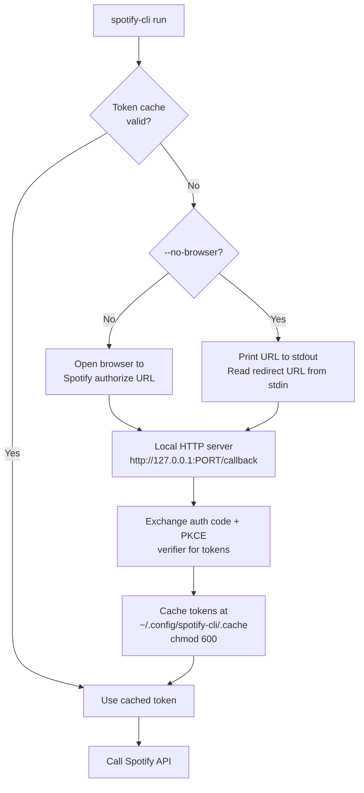

# Authentication Flow — OAuth 2.0 Authorization Code with PKCE

**Version**: 1.0
**Created**: 2026-06-03
**Author**: Orlando Bruno
**Status**: Accepted
**Area**: sys
**Related Documents**: [Research: Spotify API Playlist Creation](../02_Research/01_Spotify-API-Playlist-Creation.md) · [PRD](../01_PRD/prd.md)

---

## Executive Summary

The Spotify CLI must act on behalf of a specific user to create and manage playlists. Authorization Code with PKCE is the only flow that satisfies all constraints: no client secret stored on disk, refresh-token support for silent re-auth, and explicit recommendation by Spotify for desktop/CLI applications. A critical platform constraint — Spotify banned `localhost` as a redirect URI in November 2025 — shapes the callback configuration.

---

## 1. Problem Statement

### Context

The Spotify CLI must authenticate as a Spotify user to create playlists and add tracks on their behalf. Spotify offers three OAuth 2.0 flows for third-party applications:

1. **Authorization Code + PKCE** — browser-based, no client secret, supports refresh tokens, recommended by Spotify for desktop/mobile/CLI apps
2. **Authorization Code (with client secret)** — browser-based, requires storing a client secret, supports refresh tokens, intended for server-side apps
3. **Client Credentials** — server-to-server, no user context, cannot access user data (cannot create playlists)
4. **Implicit Grant** — deprecated by Spotify, no refresh tokens, not considered
5. **Device Authorization Grant (Device Flow)** — not supported by Spotify

The CLI runs on a developer's local machine and needs to act on behalf of a specific Spotify user account. It must survive session restarts without re-authentication.

A critical platform constraint exists: Spotify banned `localhost` as a valid redirect URI in November 2025. The redirect must use `http://127.0.0.1:{port}/callback`.

### Desired Outcome

- CLI authenticates a user with the minimum set of credentials (no stored secrets beyond client ID)
- Token persists across runs; re-authentication is only needed if the token is revoked
- Works in both interactive (browser) and headless (no-browser) environments

---

## 2. Architecture Overview



`SpotifyPKCE` (spotipy ≥2.25.1) handles steps E–I automatically when `cache_path` is configured explicitly.

---

## 3. Options Considered

### Option A: Authorization Code + PKCE (chosen)

**Description**: Browser-based flow using a dynamically generated PKCE code verifier. No client secret required. spotipy's `SpotifyPKCE` class implements the full flow.

**Pros**:
- No client secret — only `SPOTIFY_CLIENT_ID` required in the environment
- Supports refresh tokens — silent re-auth on subsequent runs
- Explicitly recommended by Spotify for desktop and CLI applications
- PKCE (Proof Key for Code Exchange) prevents authorization code interception attacks on public clients
- spotipy ≥2.25.1 handles code verifier generation, browser launch, local HTTP redirect capture, token exchange, and silent refresh

**Cons**:
- First run requires a browser (mitigated by `--no-browser` flag, FR-09)

### Option B: Authorization Code with client secret

**Description**: Server-side OAuth 2.0 Authorization Code flow. Requires `SPOTIFY_CLIENT_SECRET` in addition to `SPOTIFY_CLIENT_ID`.

**Pros**:
- Mature, well-understood flow

**Cons**:
- Requires storing `SPOTIFY_CLIENT_SECRET` as an environment variable — anyone with env access can impersonate the app
- Intended for server-side apps where secrets can be protected; no security benefit over PKCE for a local CLI
- Rejected: unnecessary secret management burden with no upside

### Option C: Client Credentials

**Description**: Machine-to-machine flow; no user context.

**Pros**:
- Simpler — no browser interaction required

**Cons**:
- No user context — cannot read user profile, cannot create playlists on behalf of a user
- Only suitable for public data queries (search, catalogue browsing) without write access
- Rejected: does not support the primary use case (playlist creation)

### Option D: Device Authorization Grant

**Description**: Allows auth without a browser callback — the user enters a code on another device.

**Pros**:
- Would work in headless environments without URL copy-paste

**Cons**:
- Not implemented by Spotify — the endpoint does not exist in their API
- Rejected: not available

---

## 4. Chosen Solution

**Decision**: Authorization Code with PKCE — `SpotifyPKCE` class in spotipy.

**Rationale**:
- Only flow that provides user-scoped write access without requiring a stored client secret
- Refresh tokens eliminate repeated browser auth within the token TTL
- Aligns with Spotify's documented guidance for this application type
- spotipy ≥2.25.1 provides a complete, tested implementation; no custom auth code needed

---

## 5. Implementation Specification

### Components

| Component | Responsibility | Technology |
|-----------|---------------|------------|
| `SpotifyPKCE` | Full PKCE auth flow: code verifier, browser open, redirect capture, token exchange, silent refresh | spotipy ≥2.25.1 |
| Local HTTP server | Capture the `?code=` redirect from Spotify | Built into `SpotifyPKCE` |
| Token cache | Persist access + refresh tokens across runs | `~/.config/spotify-cli/.cache` (chmod 600) |
| `--no-browser` mode | Print auth URL to stdout; read redirect URL from stdin for headless environments | CLI flag (FR-09) |

### Key Interfaces

```python
import spotipy
from spotipy.oauth2 import SpotifyPKCE

auth_manager = SpotifyPKCE(
    client_id=os.environ["SPOTIFY_CLIENT_ID"],
    redirect_uri=f"http://127.0.0.1:{port}/callback",
    scope="playlist-modify-public playlist-modify-private user-read-private",
    cache_path=Path.home() / ".config" / "spotify-cli" / ".cache",
    open_browser=not no_browser,
)

sp = spotipy.Spotify(auth_manager=auth_manager)
```

Scopes required: `playlist-modify-public playlist-modify-private user-read-private`

---

## 6. Performance & Cost

| Metric | Expected | Target |
|--------|----------|--------|
| First-run auth latency | ~3–10 s (browser round-trip) | < 15 s |
| Subsequent run auth overhead | < 200 ms (token cache read) | < 500 ms |
| Token refresh (silent) | < 500 ms (one HTTPS round-trip) | < 1 s |

---

## 7. Quality Assurance & Validation

### Success Metrics

- [ ] First-run: browser opens, redirect captured, tokens written to `~/.config/spotify-cli/.cache` with permissions 600
- [ ] Second run: no browser opened, existing token used silently
- [ ] Expired access token: silent refresh via stored refresh token, no user interaction
- [ ] `--no-browser` flag: URL printed to stdout, redirect URL accepted via stdin, auth completes
- [ ] Revoked refresh token: clear error message prompts re-authentication

### Testing Strategy

- **Unit tests**: mock `SpotifyPKCE` to verify `cache_path`, `redirect_uri`, and `scope` are set correctly; test `--no-browser` path
- **Integration tests**: full auth flow against Spotify sandbox credentials (first-run and token-refresh paths)

---

## 8. Risks & Mitigation

| Risk | Impact | Likelihood | Mitigation |
|------|--------|------------|------------|
| Token cache written world-readable | High (credential exposure) | Low (fixed in spotipy ≥2.25.1) | Pin `spotipy>=2.25.1`; verify file permissions in CI |
| Port collision on redirect server | Medium (auth fails) | Low | Generate a random available port on each auth invocation |
| Spotify bans `127.0.0.1` (as it did `localhost`) | High (auth broken for all users) | Very Low | Monitor Spotify changelog; abstract redirect URI construction |
| Refresh token revoked by user | Low (one-time re-auth) | Medium | Clear error message with instructions to re-authenticate |
| Headless environment with no browser | Medium (auth blocked) | Medium | `--no-browser` flag (FR-09) prints URL for manual completion |

---

## 9. Implementation Roadmap

### Phase 1: Core auth module

- [ ] Add `spotipy>=2.25.1` to dependencies
- [ ] Implement `auth.py` — wraps `SpotifyPKCE` with explicit `cache_path` and random port selection
- [ ] Ensure cache file is created with permissions 600

### Phase 2: Headless support

- [ ] Implement `--no-browser` flag (FR-09) — print URL, read redirect URL from stdin
- [ ] Document headless setup in README

### Phase 3: Error handling & UX

- [ ] Detect revoked refresh token and surface clear re-auth prompt
- [ ] Validate `SPOTIFY_CLIENT_ID` present at startup; fail fast with actionable message
- [ ] Reject `SPOTIFY_CLIENT_SECRET` if present to avoid confusion (log warning)

---

## 10. Decision Log

| Date | Decision | Rationale |
|------|----------|-----------|
| 2026-06-03 | Adopt Authorization Code with PKCE via `SpotifyPKCE` | Only flow providing user-scoped write access without a stored client secret; Spotify-recommended for CLI apps |

---

## 11. Success Criteria

- [ ] CLI authenticates successfully on first run (browser flow)
- [ ] CLI operates silently on subsequent runs without re-authentication
- [ ] No `SPOTIFY_CLIENT_SECRET` required or accepted
- [ ] Token cache stored at `~/.config/spotify-cli/.cache` with permissions 600
- [ ] `--no-browser` flag enables headless authentication

---

## 12. Related Documents

- [Research: Spotify API Playlist Creation](../02_Research/01_Spotify-API-Playlist-Creation.md)
- [PRD — FR-01, FR-02, FR-09, NFR-01, NFR-02](../01_PRD/prd.md)

---

**Last Updated**: 2026-06-03 by Orlando Bruno
