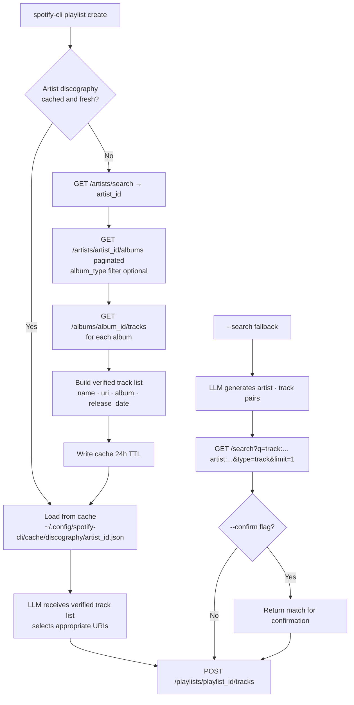

# Track Resolution Strategy — Discography-First over Search-First

**Version**: 1.0
**Created**: 2026-06-03
**Author**: Orlando Bruno
**Status**: Accepted
**Area**: sys
**Related Documents**: [Research: Spotify API Playlist Creation](../02_Research/01_Spotify-API-Playlist-Creation.md) · [Research: Spotify API Objects, Attributes & Capabilities](../02_Research/02_Spotify-API-Objects-Attributes-Capabilities.md) · [PRD](../01_PRD/prd.md) · [ADR-001: Authentication Flow](./ADR-001__sys__authentication-flow-pkce.md)

---

## Executive Summary

The CLI must resolve desired tracks into Spotify URIs before creating a playlist. Discography-first is chosen as the primary strategy: the CLI fetches the full verified track catalogue for a given artist and passes it to the LLM to select from, ensuring the LLM never guesses a track name or resolves an ambiguous title to the wrong recording. Search-first is retained as an explicit fallback for one-off lookups and very prolific artists. This decision is shaped by the November 2024 removal of Spotify's recommendation and audio-features endpoints, which means the LLM must supply all curation intent — making URI resolution accuracy critical.

---

## 1. Problem Statement

### Context

The CLI must resolve a set of desired tracks into Spotify URIs before creating a playlist. There are two viable strategies:

**Search-first**: The LLM generates human-readable `{artist, track}` pairs from its training knowledge. The CLI calls `GET /search` for each pair and takes the top result.

**Discography-first**: The CLI fetches the complete track catalogue for a given artist via `GET /artists/{id}/albums` + `GET /albums/{id}/tracks`. The LLM receives the verified list of track names and URIs and selects from it.

The core tension is between convenience (search-first requires no extra API calls) and reliability (discography-first guarantees the LLM only selects real, currently-available tracks).

A key constraint discovered during research: Spotify removed `GET /recommendations`, `GET /audio-features`, and `GET /artists/{id}/related-artists` in November 2024. This means the CLI cannot use Spotify for discovery — the LLM must supply all curation intent. Given this, the accuracy of the URI resolution step is critical: if the LLM guesses a track name wrong and search returns the wrong result, the playlist silently contains the wrong track.

Real-world disambiguation examples that would fail with search-first:
- "Hurt" → Spotify may return Nine Inch Nails when Johnny Cash is intended
- "Creep" → Radiohead or TLC depending on search ranking
- Live/remaster versions of well-known songs often outrank studio originals in search results

### Desired Outcome

- The LLM always selects from verified, currently-available Spotify URIs — no silent wrong-track writes
- A fallback path exists for one-off lookups and interactive use cases
- API call overhead is minimised across sessions through caching

---

## 2. Architecture Overview



Discography-first (top path) is the default. Search-first (bottom path) is activated via `--search` flag or automatic fallback.

---

## 3. Options Considered

### Option A: Discography-First (chosen)

**Description**: CLI fetches all albums and tracks for a given artist using `GET /artists/{id}/albums` (paginated) + `GET /albums/{id}/tracks`. Returns the full verified track list (name, album, release date, URI) to the LLM. LLM selects from real, Spotify-confirmed URIs.

**Pros**:
- LLM selects from verified Spotify URIs — no name guessing, no disambiguation errors
- Combined with the 24h discography cache (FR-15), subsequent requests for the same artist cost zero API calls
- Supports rich filtering before LLM selection: `album_type`, `release_date` range, `genres[]` on the artist object
- LLM can use real track/album metadata (release date, album name) to make contextually appropriate selections

**Cons**:
- Requires two extra API traversal steps (artist ID lookup + album pagination) before the LLM can select
- Very prolific artists (Johnny Cash: 60+ albums, Bob Dylan: 50+ albums) require pagination handling and may hit rate limits without the cache
- Requires the caller to specify an artist before requesting tracks — cannot handle "give me a track by any 70s country artist" without multiple traversals

### Option B: Search-First

**Description**: LLM generates `{artist, track}` pairs from training knowledge. CLI calls `GET /search?q=track:{name} artist:{artist}&type=track&limit=1` for each pair.

**Pros**:
- Simpler implementation; works for any track without needing the full discography
- No pagination required; each lookup is a single API call

**Cons**:
- Fails silently on disambiguation: wrong version, wrong artist, live recording instead of studio
- LLM training data may be outdated — track or artist names may differ from Spotify's canonical form
- Retained as fallback for: tracks from artists not found in discography traversal, or explicit `--search` mode

### Option C: Hybrid (search with confirmation loop)

**Description**: Search-first, but returns the canonical match back to the caller before writing. The `--confirm` flag (FR-08) implements this for interactive use.

**Pros**:
- Catches disambiguation errors before they reach the playlist
- Acceptable for human-interactive use

**Cons**:
- Adds a round-trip for the agent: search → confirm → add. Increases latency and complexity.
- Not preferred for agent-driven batch creation
- Still relies on LLM-generated track names as the starting point

---

## 4. Chosen Solution

**Decision**: Discography-First as primary strategy; Search-First retained as explicit fallback.

**Rationale**:
- With Spotify's recommendation endpoints removed, the LLM is solely responsible for curation intent — URI resolution errors cannot be caught by a secondary discovery step
- Discography-first eliminates the entire class of disambiguation failures by constraining LLM selection to verified URIs
- The 24h cache (FR-15) eliminates the API call overhead for repeated artist lookups, making the traversal cost amortised to near-zero in practice
- Search-first fallback preserves flexibility for one-off lookups and interactive workflows without complicating the primary path

---

## 5. Implementation Specification

### Components

| Component | Responsibility | Technology |
|-----------|---------------|------------|
| `discography.py` | Fetch and paginate artist albums + tracks; build verified track list | spotipy — `artist_albums()`, `album_tracks()` |
| `cache.py` | Read/write per-artist discography cache with 24h TTL | JSON files at `~/.config/spotify-cli/cache/discography/{artist_id}.json` |
| `search.py` | Search-first fallback — single track lookup by artist + name | spotipy — `search()` |
| `resolver.py` | Orchestrate: check cache → discography traversal → LLM selection → fallback to search | Python |

### Key Interfaces

```python
# discography command — primary path
spotify-cli discography {artist_name}
# Returns paginated NDJSON:
# { "name": "...", "uri": "...", "album": "...", "release_date": "...", "track_number": N }

# Filter flags
--album-type album|single|compilation
--from-year YYYY
--to-year YYYY

# Search fallback command
spotify-cli search --artist "..." --track "..."
# Returns top match as JSON:
# { "name": "...", "uri": "...", "album": "...", "artists": [...] }
```

```python
# Cache schema
{
  "artist_id": "...",
  "artist_name": "...",
  "fetched_at": "ISO-8601",
  "tracks": [
    {
      "name": "...",
      "uri": "...",
      "album": "...",
      "release_date": "YYYY-MM-DD",
      "track_number": 1,
      "album_type": "album|single|compilation"
    }
  ]
}
```

---

## 6. Performance & Cost

| Metric | Expected | Target |
|--------|----------|--------|
| Discography traversal (first fetch, ~10 albums) | ~2–5 s (paginated API calls) | < 10 s |
| Discography traversal (prolific artist, 60+ albums) | ~15–30 s | < 60 s |
| Cached discography read | < 50 ms | < 100 ms |
| Search fallback (single track) | < 500 ms | < 1 s |
| Cache hit rate after first use | ~100% within 24h TTL | > 95% |

---

## 7. Quality Assurance & Validation

### Success Metrics

- [ ] Discography traversal returns all tracks for a known artist and matches expected count
- [ ] Cache is written after first fetch and read on subsequent calls within 24h
- [ ] Expired cache (> 24h) triggers a fresh traversal
- [ ] `--album-type` and `--from-year`/`--to-year` filters correctly reduce the returned track list
- [ ] Search fallback returns the correct top result for an unambiguous query
- [ ] `--confirm` flag on search-first path returns the candidate match before adding to playlist
- [ ] Disambiguation scenario (e.g., "Hurt") resolves to the correct artist when discography-first is used

### Testing Strategy

- **Unit tests**: mock spotipy client to verify pagination logic, cache read/write, TTL expiry, filter application
- **Integration tests**: full discography fetch against Spotify sandbox credentials for a known artist; verify track count and URI format; test cache round-trip

---

## 8. Risks & Mitigation

| Risk | Impact | Likelihood | Mitigation |
|------|--------|------------|------------|
| Very prolific artist hits Spotify rate limit during traversal | Medium (fetch fails mid-way) | Low–Medium | Implement exponential backoff with retry; cache partial results and resume |
| Artist has no albums of requested `album_type` | Low (empty result set) | Low | Return empty list with informative message; suggest relaxing filter |
| LLM selects a URI that has since been removed from Spotify | Medium (playlist add fails) | Low | Handle 400/404 from `POST /playlists/.../tracks`; surface per-track error |
| Cache file corruption | Low (one bad fetch) | Very Low | Validate JSON schema on read; delete and re-fetch on validation failure |
| Search-first fallback returns wrong version (live vs. studio) | Medium (wrong track in playlist) | Medium | Document limitation; encourage discography-first; `--confirm` flag for interactive use |

---

## 9. Implementation Roadmap

### Phase 1: Discography traversal

- [ ] Implement `discography.py` — `get_artist_id()`, `get_all_albums()`, `get_all_tracks()`
- [ ] Add pagination handling for `artist_albums()` and `album_tracks()`
- [ ] Implement `--album-type`, `--from-year`, `--to-year` filter flags

### Phase 2: Caching layer

- [ ] Implement `cache.py` — read/write JSON cache per artist ID with 24h TTL
- [ ] Integrate cache check into `resolver.py` before making API calls
- [ ] Ensure cache directory created at `~/.config/spotify-cli/cache/discography/` on first use

### Phase 3: Search fallback and confirmation

- [ ] Implement `search.py` — `search_track(artist, track)` returning top match
- [ ] Add `--search` flag to bypass discography-first for explicit one-off lookups
- [ ] Integrate `--confirm` flag (FR-08) for interactive disambiguation on search path

---

## 10. Decision Log

| Date | Decision | Rationale |
|------|----------|-----------|
| 2026-06-03 | Adopt discography-first as primary resolution strategy | Eliminates silent disambiguation failures; LLM selects only from verified Spotify URIs; cache amortises API cost |
| 2026-06-03 | Retain search-first as explicit fallback | Preserves flexibility for one-off lookups and interactive workflows without complicating the primary path |

---

## 11. Success Criteria

- [ ] LLM never receives a fabricated track name or URI — all URIs are fetched from Spotify before LLM selection
- [ ] Discography cache eliminates repeated API calls for the same artist within a 24h window
- [ ] Search-first fallback activates correctly when `--search` flag is passed or discography traversal fails
- [ ] Disambiguation scenarios (e.g., "Hurt", "Creep") resolve to the correct recording when using discography-first
- [ ] Filter flags (`--album-type`, `--from-year`, `--to-year`) correctly constrain the track list before LLM selection

---

## 12. Related Documents

- [Research: Spotify API Playlist Creation](../02_Research/01_Spotify-API-Playlist-Creation.md)
- [Research: Spotify API Objects, Attributes & Capabilities](../02_Research/02_Spotify-API-Objects-Attributes-Capabilities.md)
- [PRD — FR-03, FR-04, FR-08, FR-11, FR-15](../01_PRD/prd.md)
- [ADR-001: Authentication Flow — OAuth 2.0 Authorization Code with PKCE](./ADR-001__sys__authentication-flow-pkce.md)

---

**Last Updated**: 2026-06-03 by Orlando Bruno
