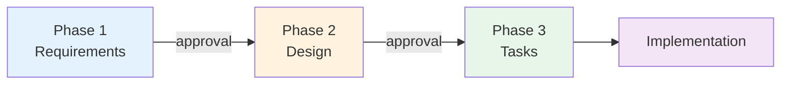

# Specifications

Feature specifications for Spotify CLI. Each spec follows a 3-phase workflow with approval gates.

## Active Specs

| Feature | Phase | Status | Created |
|---------|-------|--------|---------|
| [SPEC-001](SPEC-001__auth-login.md) | Auth Login | Draft | 2026-06-03 |
| [SPEC-002](SPEC-002__discography-browse.md) | Discography Browse | Draft | 2026-06-03 |
| [SPEC-003](SPEC-003__playlist-create.md) | Playlist Create | Draft | 2026-06-03 |

## Archived Specs

| Feature | Completed | Notes |
|---------|-----------|-------|
| — | No archived specs yet | — |

## Spec Workflow



1. **Requirements** (`01_requirements.md`) — What to build, success criteria
2. **Design** (`02_design.md`) — How to build it, architecture
3. **Tasks** (`03_tasks.md`) — Implementation breakdown

## Folder Structure

```
Specs/
├── active/
│   └── feature-name/
│       ├── 01_requirements.md
│       ├── 02_design.md
│       └── 03_tasks.md
└── archive/
    └── completed-feature/
        └── ...
```

## When to Create a Spec

- Building a new feature or system
- Requirements are complex enough to warrant documentation
- Multiple phases of work needed
- You want approval gates before committing to implementation

---

Last Updated: 2026-06-03
