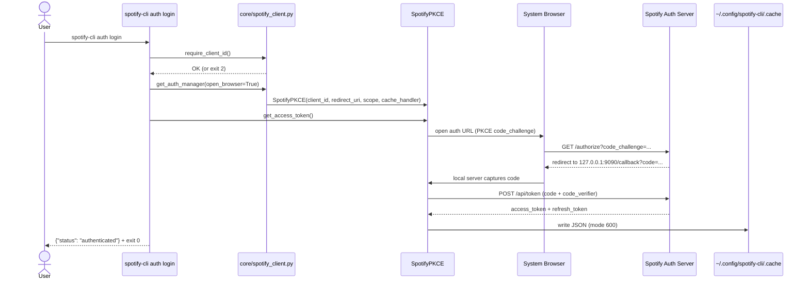
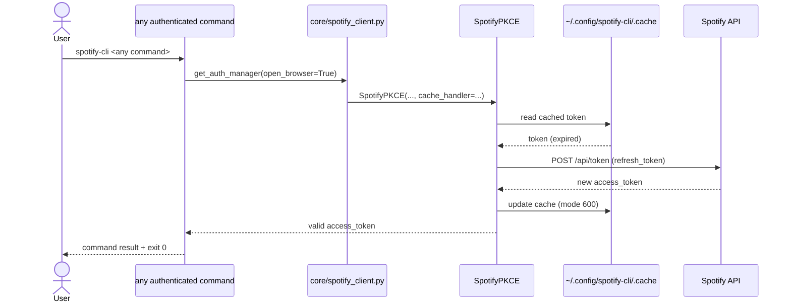

# SPEC-001: Auth Login

**Version**: 1.0
**SPEC**: SPEC-001
**Created**: 2026-06-03
**Author**: Orlando Bruno
**Status**: Draft
**ADR**: [ADR-001 — Authentication Flow — OAuth 2.0 Authorization Code with PKCE](../03_ADR/ADR-001__sys__authentication-flow-pkce.md)

---

## Table of Contents

1. [Requirements](#1-requirements)
2. [Design](#2-design)
3. [Tasks](#3-tasks)

---

## 1. Requirements

### 1.1 Overview

The `auth` command group provides the full authentication lifecycle for Spotify CLI. It handles first-run browser-based login via OAuth 2.0 Authorization Code + PKCE, silent token refresh on subsequent runs, token introspection, and logout. Authentication credentials are stored locally at `~/.config/spotify-cli/.cache` with 600 permissions.

The `auth` group exposes three sub-commands:

- `spotify-cli auth login` — initiates PKCE flow; opens browser on first run
- `spotify-cli auth status` — prints current token state as structured JSON
- `spotify-cli auth logout` — deletes the token cache file

### 1.2 Problem Statement

Spotify's API requires a valid OAuth 2.0 access token for every request. A CLI tool must provide a frictionless first-run authentication experience, a completely silent re-authentication path for subsequent invocations, and a safe credential storage mechanism — all without requiring a web server or persistent daemon.

### 1.3 Current State

No authentication exists. The CLI cannot make any authenticated Spotify API calls. Users have no way to provide or manage credentials through the tool.

### 1.4 User Stories

**auth login**

- As a first-time user, I want to run `spotify-cli auth login` so that a browser window opens and I can authorize the application with my Spotify account.
- As a returning user, I want subsequent CLI invocations to silently refresh my access token so that I never have to log in again until I explicitly log out.
- As a user on an SSH/headless environment, I want to pass `--no-browser` so that the auth URL is printed to stdout and I can complete the flow by pasting the redirect URL.
- As a user who has not set `SPOTIFY_CLIENT_ID`, I want to receive a clear, structured error message explaining which env var is missing and how to fix it, with exit code 2.

**auth status**

- As a user, I want to run `spotify-cli auth status` so that I can inspect whether my current token is valid, expired, or missing — without triggering a refresh.
- As a script author, I want the output to be structured JSON so that I can pipe it into other tools.

**auth logout**

- As a user, I want to run `spotify-cli auth logout` so that the cached token is deleted and I am fully de-authenticated.
- As a user who has already logged out or never logged in, I want a graceful JSON response rather than an error, so that the command is safely idempotent.

### 1.5 Functional Requirements

| ID | Requirement | PRD Ref | Priority |
|----|-------------|---------|----------|
| SFR-01 | `auth login` opens the Spotify authorization URL in the default system browser | FR-01 | Must |
| SFR-02 | `auth login` starts a local HTTP server on `http://127.0.0.1:9090/callback` to capture the OAuth redirect | FR-01 | Must |
| SFR-03 | `auth login` implements PKCE (code verifier + code challenge) in the authorization flow | FR-01 | Must |
| SFR-04 | On success, tokens are cached at `~/.config/spotify-cli/.cache`; the parent directory is created if absent | NFR-01 | Must |
| SFR-05 | Subsequent CLI invocations silently refresh the access token using the cached refresh token — no browser interaction | FR-02 | Must |
| SFR-06 | `auth login --no-browser` prints the auth URL to stdout and reads the redirect URL from stdin | FR-09 | Must |
| SFR-07 | `auth status` returns a JSON object with `status`, `expires_in_seconds`, and `scopes` fields | FR-02 | Must |
| SFR-08 | `auth logout` deletes the cache file and returns a JSON confirmation; is idempotent when no cache exists | — | Must |
| SFR-09 | `SPOTIFY_CLIENT_ID` and `SPOTIFY_CLIENT_SECRET` are read from environment variables; absence of `SPOTIFY_CLIENT_ID` exits with code 2 and a structured JSON error on stderr | NFR-02 | Must |
| SFR-10 | All `auth` sub-commands support `--help` / `-h` with `Usage:` and `Example:` blocks | NFR-10 | Must |

### 1.6 Non-Functional Requirements

| ID | Requirement | PRD Ref | Target |
|----|-------------|---------|--------|
| SNFR-01 | Token cache file permissions: 600 (owner read/write only) | NFR-01 | Enforced by spotipy ≥2.25.1 |
| SNFR-02 | Credentials sourced from env vars only; never hardcoded or logged | NFR-02 | No exceptions |
| SNFR-03 | Semantic exit codes: 0 = success, 1 = general failure, 2 = missing required config | NFR-09 | All commands |
| SNFR-04 | `--help` startup time ≤500ms | NFR-18 | Typer lazy imports |
| SNFR-05 | No user input passed to shell execution | NFR-14 | N/A for auth |
| SNFR-06 | All JSON output uses double-quoted keys; errors on stderr, data on stdout | — | Consistent across commands |

### 1.7 Success Criteria

- [ ] `spotify-cli auth login` completes the PKCE flow end-to-end and writes a token cache readable by spotipy
- [ ] A second invocation of any authenticated command does not open a browser
- [ ] `spotify-cli auth login --no-browser` works in a headless environment (no `$DISPLAY`, no browser binary)
- [ ] `spotify-cli auth status` returns correct JSON for all three states: `valid`, `expired`, `missing`
- [ ] `spotify-cli auth logout` deletes the cache file; running it twice does not error
- [ ] Missing `SPOTIFY_CLIENT_ID` exits with code 2 and structured JSON on stderr
- [ ] All commands return exit code 0 on success
- [ ] `uv run pytest tests/auth/` passes with ≥80% coverage

### 1.8 Scope and Boundaries

**In scope:**
- `auth login`, `auth status`, `auth logout` commands
- PKCE flow via spotipy `SpotifyPKCE`
- Token cache at `~/.config/spotify-cli/.cache`
- `--no-browser` headless mode
- Structured JSON output for all commands
- Env var validation with semantic exit codes

**Out of scope:**
- `--version` flag (NFR-12 — separate root-level concern)
- Token sharing across multiple Spotify accounts
- Credential encryption beyond filesystem permissions
- GUI or web-based auth interface
- Refresh token rotation logic beyond what spotipy handles natively

### 1.9 Constraints

- Must use `spotipy ≥2.25.1` — earlier versions do not enforce 600 permissions on `.cache` (CVE-2025-27154)
- Must use `typer` as the CLI framework — no argparse or click directly
- Must use `uv` for all package management and test execution
- Redirect URI is fixed at `http://127.0.0.1:9090/callback` — must be registered in the Spotify developer app

### 1.10 Dependencies

| Dependency | Type | Notes |
|------------|------|-------|
| `spotipy ≥2.25.1` | Package | Provides `SpotifyPKCE` and `CacheFileHandler` |
| `typer` | Package | CLI framework, auto-generates `--help` |
| `SPOTIFY_CLIENT_ID` | Env var | Required; blocks all auth operations if absent |
| `SPOTIFY_CLIENT_SECRET` | Env var | Required by spotipy even for PKCE |
| `http://127.0.0.1:9090/callback` | Spotify App Config | Must be registered in Spotify developer dashboard |
| ADR-001 | Design decision | Rationale for PKCE over Implicit flow |

---

## 2. Design

### 2.1 File Structure

```
spotify-cli/
├── pyproject.toml
├── SKILL.md                              (NFR-16 — future)
├── spotify_cli/
│   ├── __init__.py
│   ├── main.py                           ← Typer app entry point; registers auth group
│   ├── auth/
│   │   ├── __init__.py
│   │   └── commands.py                   ← login / status / logout commands
│   └── core/
│       ├── __init__.py
│       └── spotify_client.py             ← shared SpotifyPKCE client factory
└── tests/
    ├── __init__.py
    └── auth/
        ├── __init__.py
        └── test_auth_commands.py
```

**Responsibilities by file:**

| File | Responsibility |
|------|---------------|
| `main.py` | Creates root Typer app, registers `auth` sub-app, defines entry point |
| `auth/commands.py` | Implements `login`, `status`, `logout`; owns CLI flags, output formatting, exit codes |
| `core/spotify_client.py` | `get_auth_manager(open_browser)` factory; owns `CACHE_PATH`, `SCOPES`, env var validation |
| `tests/auth/test_auth_commands.py` | Unit tests for all auth commands with mocked spotipy |

### 2.2 Data Flow — PKCE Login Flow



**Silent refresh flow (subsequent runs):**



### 2.3 Component Responsibilities

| Component | Public Interface | Side Effects |
|-----------|-----------------|--------------|
| `get_auth_manager(open_browser=True)` | Returns `SpotifyPKCE` instance | Creates `~/.config/spotify-cli/` dir if absent |
| `require_client_id()` | Returns None or raises `typer.Exit(code=2)` | Writes JSON error to stderr |
| `login(no_browser: bool)` | Typer command, no return value | Opens browser or prints URL; writes cache |
| `status()` | Typer command, no return value | Reads cache; prints JSON to stdout |
| `logout()` | Typer command, no return value | Deletes cache file if present |

### 2.4 Auth Status Output Schema

```json
// Token valid
{ "status": "valid", "expires_in_seconds": 3245, "scopes": ["playlist-modify-public", "playlist-modify-private", "user-read-private"] }

// Token expired (refresh needed)
{ "status": "expired", "expires_in_seconds": -120 }

// No cache file
{ "status": "missing" }
```

### 2.5 Key Design Decisions

**Why `CacheFileHandler` rather than a custom cache?**
spotipy ≥2.25.1 enforces 600 permissions on write as part of the CVE-2025-27154 fix. Delegating to the library avoids re-implementing secure file I/O and stays aligned with spotipy's security model.

**Why `open_browser=False` for `--no-browser` rather than a separate flow?**
spotipy's `SpotifyPKCE` natively handles headless mode via the `open_browser` constructor flag — it prints the auth URL and waits for the user to paste the redirect URL. No custom HTTP server logic is needed in the CLI layer.

**Why a single `CACHE_PATH` constant in `core/spotify_client.py`?**
All three auth commands and any future authenticated command share the same token cache. Centralizing the path prevents drift and makes testing easier via monkeypatching.

**Why `typer.Exit(code=2)` for missing env vars rather than an exception?**
Semantic exit codes are a first-class NFR (NFR-09). Typer's `Exit` exception cleanly terminates the process with the correct code without printing a traceback, and it can be caught in tests without subprocess overhead.

### 2.6 Test Cases

| TC | Command | Scenario | Expected Outcome | Exit Code |
|----|---------|----------|-----------------|-----------|
| TC-01 | `auth login` | `SPOTIFY_CLIENT_ID` set; mock auth manager succeeds | Browser opens; cache written; `{"status": "authenticated"}` on stdout | 0 |
| TC-02 | `auth login` | `SPOTIFY_CLIENT_ID` unset | Structured JSON error on stderr | 2 |
| TC-03 | `auth login --no-browser` | `SPOTIFY_CLIENT_ID` set; `open_browser=False` | Auth URL printed to stdout; redirect URL accepted from stdin | 0 |
| TC-04 | `auth status` | Valid cached token (mock) | `{"status": "valid", "expires_in_seconds": N, "scopes": [...]}` on stdout | 0 |
| TC-05 | `auth status` | No cache file | `{"status": "missing"}` on stdout | 0 |
| TC-06 | `auth logout` | Cache file exists | Cache deleted; `{"status": "logged_out"}` on stdout | 0 |
| TC-07 | `auth logout` | No cache file | `{"status": "no_cache"}` on stdout | 0 |
| TC-08 | Any authenticated command | Valid refresh token cached; access token expired | Silent refresh; no browser; command succeeds | 0 |

---

## 3. Tasks

### 3.1 Phase 1 — Project Scaffold

**Goal:** Working Typer CLI entry point with `auth` sub-app registered; `uv run spotify-cli --help` returns the root help text.

| Task | Description | File(s) |
|------|-------------|---------|
| T-01 | Create `pyproject.toml` with `spotipy ≥2.25.1`, `typer`, `pytest`, `pytest-cov` dependencies and `[project.scripts]` entry point | `pyproject.toml` |
| T-02 | Create package skeleton with `__init__.py` files | `spotify_cli/__init__.py`, `auth/__init__.py`, `core/__init__.py`, `tests/__init__.py`, `tests/auth/__init__.py` |
| T-03 | Implement root Typer app and register `auth` sub-app | `spotify_cli/main.py` |
| T-04 | Verify `uv run spotify-cli --help` runs in ≤500ms | Manual |

**`pyproject.toml` (key sections):**

```toml
[project]
name = "spotify-cli"
version = "0.1.0"
requires-python = ">=3.11"
dependencies = [
    "spotipy>=2.25.1",
    "typer>=0.12.0",
]

[project.scripts]
spotify-cli = "spotify_cli.main:app"

[tool.uv]
dev-dependencies = [
    "pytest>=8.0",
    "pytest-cov>=5.0",
]
```

**`spotify_cli/main.py`:**

```python
import typer
from spotify_cli.auth import commands as auth_commands

app = typer.Typer(help="Spotify CLI — manage your Spotify account from the terminal.")
auth_app = typer.Typer(help="Authentication commands.")
app.add_typer(auth_app, name="auth")

auth_app.command("login")(auth_commands.login)
auth_app.command("status")(auth_commands.status)
auth_app.command("logout")(auth_commands.logout)

if __name__ == "__main__":
    app()
```

### 3.2 Phase 2 — Core Auth (`auth login`)

**Goal:** `spotify-cli auth login` completes the PKCE flow, writes the cache, and exits 0. Missing `SPOTIFY_CLIENT_ID` exits 2 with structured JSON on stderr.

| Task | Description | File(s) |
|------|-------------|---------|
| T-05 | Implement `get_auth_manager()` factory with `CACHE_PATH`, `SCOPES`, and `CacheFileHandler` | `core/spotify_client.py` |
| T-06 | Implement `require_client_id()` guard with structured JSON error and `Exit(code=2)` | `core/spotify_client.py` |
| T-07 | Implement `auth login` command: call guard, call factory, call `get_access_token()`, output JSON | `auth/commands.py` |
| T-08 | Ensure `CACHE_PATH.parent` is created with `mkdir(parents=True, exist_ok=True)` | `core/spotify_client.py` |
| T-09 | Write unit tests for TC-01 and TC-02 | `tests/auth/test_auth_commands.py` |

**`core/spotify_client.py`:**

```python
import os
import pathlib
import typer
import spotipy
from spotipy.oauth2 import SpotifyPKCE

CACHE_PATH = pathlib.Path.home() / ".config" / "spotify-cli" / ".cache"
SCOPES = "playlist-modify-public playlist-modify-private user-read-private"
REDIRECT_URI = "http://127.0.0.1:9090/callback"


def require_client_id() -> None:
    if not os.environ.get("SPOTIFY_CLIENT_ID"):
        typer.echo(
            '{"error": "SPOTIFY_CLIENT_ID not set", '
            '"reason": "Required env var missing", '
            '"suggestion": "export SPOTIFY_CLIENT_ID=your_client_id", '
            '"help": "spotify-cli auth --help"}',
            err=True,
        )
        raise typer.Exit(code=2)


def get_auth_manager(open_browser: bool = True) -> SpotifyPKCE:
    CACHE_PATH.parent.mkdir(parents=True, exist_ok=True)
    return SpotifyPKCE(
        client_id=os.environ["SPOTIFY_CLIENT_ID"],
        redirect_uri=REDIRECT_URI,
        scope=SCOPES,
        cache_handler=spotipy.cache_handler.CacheFileHandler(
            cache_path=str(CACHE_PATH)
        ),
        open_browser=open_browser,
    )
```

**`auth/commands.py` (login):**

```python
import json
import typer
from spotify_cli.core.spotify_client import get_auth_manager, require_client_id


def login(
    no_browser: bool = typer.Option(
        False,
        "--no-browser",
        help="Print auth URL to stdout and accept redirect URL via stdin (headless/SSH).",
    )
) -> None:
    """
    Authenticate with Spotify via OAuth 2.0 PKCE.

    Usage: spotify-cli auth login [--no-browser]
    Example: spotify-cli auth login
    Example: spotify-cli auth login --no-browser
    """
    require_client_id()
    auth_manager = get_auth_manager(open_browser=not no_browser)
    auth_manager.get_access_token()
    typer.echo(json.dumps({"status": "authenticated"}))
    raise typer.Exit(code=0)
```

### 3.3 Phase 3 — Auth Utilities (`auth status`, `auth logout`, `--no-browser`)

**Goal:** All three sub-commands work correctly; `--no-browser` passes `open_browser=False` to spotipy; `status` and `logout` are idempotent.

| Task | Description | File(s) |
|------|-------------|---------|
| T-10 | Implement `auth status`: read cached token info, compute `expires_in_seconds`, output JSON | `auth/commands.py` |
| T-11 | Implement `auth logout`: delete cache if present, return JSON; no-op if absent | `auth/commands.py` |
| T-12 | Verify `--no-browser` flag wires to `open_browser=False` in factory call | `auth/commands.py` |
| T-13 | Write unit tests for TC-03 through TC-07 | `tests/auth/test_auth_commands.py` |

**`auth/commands.py` (status and logout additions):**

```python
import time
from spotify_cli.core.spotify_client import CACHE_PATH


def status() -> None:
    """
    Print current token status as JSON.

    Usage: spotify-cli auth status
    Example: spotify-cli auth status
    """
    if not CACHE_PATH.exists():
        typer.echo(json.dumps({"status": "missing"}))
        raise typer.Exit(code=0)

    require_client_id()
    auth_manager = get_auth_manager(open_browser=False)
    token_info = auth_manager.cache_handler.get_cached_token()

    if token_info is None:
        typer.echo(json.dumps({"status": "missing"}))
        raise typer.Exit(code=0)

    expires_in = int(token_info["expires_at"] - time.time())
    state = "valid" if expires_in > 0 else "expired"
    output = {"status": state, "expires_in_seconds": expires_in}

    if state == "valid":
        output["scopes"] = token_info.get("scope", "").split()

    typer.echo(json.dumps(output))
    raise typer.Exit(code=0)


def logout() -> None:
    """
    Delete cached Spotify tokens.

    Usage: spotify-cli auth logout
    Example: spotify-cli auth logout
    """
    if CACHE_PATH.exists():
        CACHE_PATH.unlink()
        typer.echo(json.dumps({"status": "logged_out"}))
    else:
        typer.echo(json.dumps({"status": "no_cache"}))
    raise typer.Exit(code=0)
```

### 3.4 Phase 4 — Tests

**Goal:** All 8 test cases pass; coverage ≥80% for `auth/commands.py` and `core/spotify_client.py`.

| Task | Description | File(s) |
|------|-------------|---------|
| T-14 | Scaffold `test_auth_commands.py` with Typer test client and spotipy mocks | `tests/auth/test_auth_commands.py` |
| T-15 | Implement TC-01: mock `get_auth_manager`, assert stdout JSON and exit 0 | `tests/auth/test_auth_commands.py` |
| T-16 | Implement TC-02: unset env var, assert stderr JSON and exit 2 | `tests/auth/test_auth_commands.py` |
| T-17 | Implement TC-03: `--no-browser` flag, assert `open_browser=False` passed to factory | `tests/auth/test_auth_commands.py` |
| T-18 | Implement TC-04 and TC-05: mock `cache_handler.get_cached_token`, assert JSON output | `tests/auth/test_auth_commands.py` |
| T-19 | Implement TC-06 and TC-07: mock `CACHE_PATH.exists()` and `CACHE_PATH.unlink()` | `tests/auth/test_auth_commands.py` |
| T-20 | Implement TC-08: mock expired token, assert silent refresh (no browser call) | `tests/auth/test_auth_commands.py` |
| T-21 | Run coverage report; confirm ≥80% | Manual / CI |

**Test scaffold (`tests/auth/test_auth_commands.py`):**

```python
import json
import os
from unittest.mock import MagicMock, patch

import pytest
from typer.testing import CliRunner

from spotify_cli.main import app

runner = CliRunner()


@pytest.fixture(autouse=True)
def set_client_id(monkeypatch):
    monkeypatch.setenv("SPOTIFY_CLIENT_ID", "test-client-id")
    monkeypatch.setenv("SPOTIFY_CLIENT_SECRET", "test-client-secret")


def test_login_success():
    """TC-01: auth login with SPOTIFY_CLIENT_ID set opens browser and exits 0."""
    mock_manager = MagicMock()
    with patch("spotify_cli.core.spotify_client.SpotifyPKCE", return_value=mock_manager):
        result = runner.invoke(app, ["auth", "login"])
    assert result.exit_code == 0
    assert json.loads(result.output) == {"status": "authenticated"}


def test_login_missing_client_id(monkeypatch):
    """TC-02: auth login without SPOTIFY_CLIENT_ID exits 2 with JSON on stderr."""
    monkeypatch.delenv("SPOTIFY_CLIENT_ID", raising=False)
    result = runner.invoke(app, ["auth", "login"])
    assert result.exit_code == 2
    error_output = result.output  # Typer CliRunner merges stderr into output by default
    parsed = json.loads(error_output)
    assert parsed["error"] == "SPOTIFY_CLIENT_ID not set"


def test_login_no_browser():
    """TC-03: auth login --no-browser passes open_browser=False to factory."""
    mock_manager = MagicMock()
    with patch(
        "spotify_cli.core.spotify_client.SpotifyPKCE", return_value=mock_manager
    ) as mock_pkce:
        result = runner.invoke(app, ["auth", "login", "--no-browser"])
    assert result.exit_code == 0
    _, kwargs = mock_pkce.call_args
    assert kwargs.get("open_browser") is False


def test_status_valid_token():
    """TC-04: auth status with valid cached token returns status=valid."""
    import time
    mock_token = {
        "access_token": "tok",
        "expires_at": time.time() + 3600,
        "scope": "playlist-modify-public user-read-private",
    }
    mock_handler = MagicMock()
    mock_handler.get_cached_token.return_value = mock_token
    mock_manager = MagicMock()
    mock_manager.cache_handler = mock_handler

    with patch("spotify_cli.auth.commands.CACHE_PATH") as mock_path, \
         patch("spotify_cli.core.spotify_client.SpotifyPKCE", return_value=mock_manager):
        mock_path.exists.return_value = True
        result = runner.invoke(app, ["auth", "status"])

    assert result.exit_code == 0
    parsed = json.loads(result.output)
    assert parsed["status"] == "valid"
    assert parsed["expires_in_seconds"] > 0


def test_status_missing_cache():
    """TC-05: auth status with no cache file returns status=missing."""
    with patch("spotify_cli.auth.commands.CACHE_PATH") as mock_path:
        mock_path.exists.return_value = False
        result = runner.invoke(app, ["auth", "status"])
    assert result.exit_code == 0
    assert json.loads(result.output) == {"status": "missing"}


def test_logout_with_cache():
    """TC-06: auth logout deletes cache file and returns logged_out."""
    with patch("spotify_cli.auth.commands.CACHE_PATH") as mock_path:
        mock_path.exists.return_value = True
        result = runner.invoke(app, ["auth", "logout"])
    assert result.exit_code == 0
    mock_path.unlink.assert_called_once()
    assert json.loads(result.output) == {"status": "logged_out"}


def test_logout_no_cache():
    """TC-07: auth logout without cache file returns no_cache gracefully."""
    with patch("spotify_cli.auth.commands.CACHE_PATH") as mock_path:
        mock_path.exists.return_value = False
        result = runner.invoke(app, ["auth", "logout"])
    assert result.exit_code == 0
    assert json.loads(result.output) == {"status": "no_cache"}
```

### 3.5 Estimates Summary

| Phase | Tasks | Estimated Effort |
|-------|-------|-----------------|
| Phase 1 — Project scaffold | T-01 to T-04 | 1h |
| Phase 2 — Core auth (`login`) | T-05 to T-09 | 2h |
| Phase 3 — Auth utilities | T-10 to T-13 | 1.5h |
| Phase 4 — Tests | T-14 to T-21 | 2h |
| **Total** | **21 tasks** | **~6.5h** |

### 3.6 Verification Plan

**Automated (run after each phase):**

```bash
# Run all auth tests
uv run pytest tests/auth/ -v

# Run with coverage report
uv run pytest tests/auth/ --cov=spotify_cli/auth --cov=spotify_cli/core --cov-report=term-missing

# Confirm ≥80% coverage
uv run pytest tests/auth/ --cov=spotify_cli/auth --cov=spotify_cli/core --cov-fail-under=80
```

**Manual checks (after Phase 2 and Phase 3):**

- `uv run spotify-cli --help` — root help renders in ≤500ms, no traceback
- `uv run spotify-cli auth --help` — shows `login`, `status`, `logout` sub-commands
- `uv run spotify-cli auth login --help` — shows `Usage:` and `Example:` blocks, `-h` also works
- `SPOTIFY_CLIENT_ID="" uv run spotify-cli auth login` — exits 2, JSON error on stderr
- `uv run spotify-cli auth status` (no cache) — returns `{"status": "missing"}`
- `uv run spotify-cli auth logout` (no cache) — returns `{"status": "no_cache"}`, exits 0
- `stat -f "%A" ~/.config/spotify-cli/.cache` after login — must show `600`

**Headless check (after Phase 3):**

```bash
# In a session with no browser (e.g., SSH, or unset DISPLAY)
uv run spotify-cli auth login --no-browser
# Expected: prints auth URL, waits for redirect URL paste
```

### 3.7 Change Log

| Version | Date | Author | Change |
|---------|------|--------|--------|
| 1.0 | 2026-06-03 | Orlando Bruno | Initial draft — all three sections |
