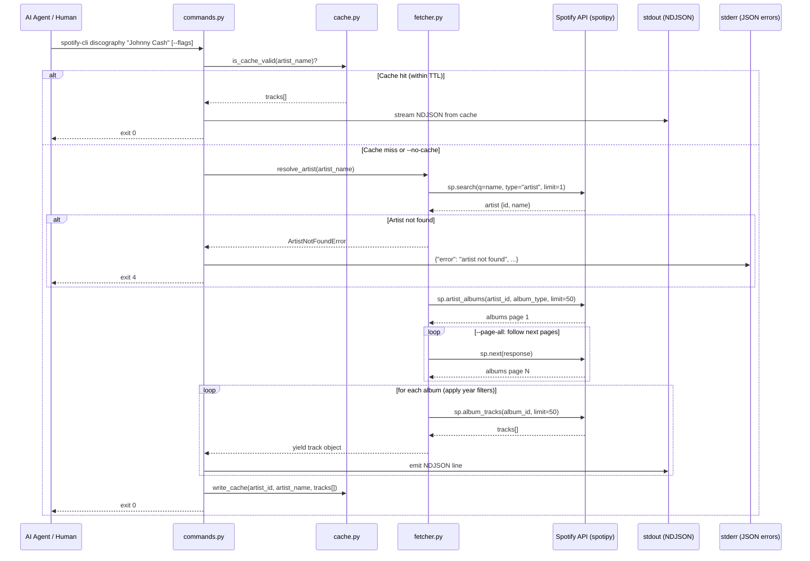

# SPEC-002: Discography Browse

**Version**: 1.0
**SPEC**: SPEC-002
**Created**: 2026-06-03
**Author**: Orlando Bruno
**Status**: Draft
**ADR**: [ADR-002 — Track Resolution Strategy — Discography-First over Search-First](../03_ADR/ADR-002__track-resolution-strategy.md)

---

## Table of Contents

1. [Requirements](#1-requirements)
2. [Design](#2-design)
3. [Tasks](#3-tasks)

---

## 1. Requirements

### 1.1 Overview

`spotify-cli discography {artist_name}` fetches a complete, paginated track catalogue for a given artist and streams it as NDJSON (one JSON object per line) to stdout. Results are cached per artist ID at `~/.config/spotify-cli/cache/discography/{artist_id}.json` with a 24-hour TTL. The command is the primary input source for the `playlist create` command — an AI agent calls `discography`, receives verified Spotify URIs, selects tracks, then pipes them to `playlist add-tracks`.

### 1.2 Problem Statement

#### Context

Today, resolving tracks for playlist creation requires an ad-hoc search-first approach — calling `sp.search()` per track with an artist + title query, which produces unreliable URI matches, pollutes stdout with ambiguous results, and forces the calling agent to deduplicate and validate each match independently. There is no stable, structured way to enumerate every track an artist has released.

#### Desired Outcome

- An AI agent or human operator can enumerate all tracks for an artist in a single command invocation.
- Each line of output is a self-contained, machine-parseable JSON object with a verified Spotify URI ready for downstream use.
- Results are cached to avoid redundant API calls across multiple invocations within a session or day.
- Filters (`--album-type`, `--from-year`, `--to-year`) reduce output to only the relevant slice of a catalogue.
- Errors are structured, actionable, and written to stderr — stdout is always clean NDJSON or empty.

### 1.3 Current State

#### What Exists

| Component | Status | Location |
|-----------|--------|----------|
| `spotify_client.py` | Implemented (SPEC-001) | `spotify_cli/auth/spotify_client.py` |
| OAuth token cache | Implemented (SPEC-001) | `~/.config/spotify-cli/cache/token.json` |
| `auth` command group | Implemented (SPEC-001) | `spotify_cli/auth/commands.py` |
| `discography` command group | Not started | — |
| Discography cache | Not started | — |
| Artist → albums → tracks traversal | Not started | — |

#### What's Missing (This Spec)

- `spotify_cli/discography/` module (commands, fetcher, cache)
- `~/.config/spotify-cli/cache/discography/` cache directory and TTL logic
- NDJSON streaming output formatter
- `--album-type`, `--from-year`, `--to-year`, `--page-all`, `--no-cache`, `--format` flags
- Structured JSON error output on stderr
- Unit and integration tests for all discography components

### 1.4 User Stories

**AI Agent (primary consumer)**

```
As an AI agent orchestrating playlist creation,
I want to retrieve all tracks for an artist as verified Spotify URIs,
so that I can select tracks and pipe them directly to `playlist add-tracks`
without any URI resolution step.
```

**Human operator (interactive use)**

```
As a developer or power user,
I want to browse an artist's full catalogue filtered by album type and year range,
so that I can review what tracks are available before building a playlist.
```

**Cache-conscious agent**

```
As an AI agent called repeatedly within the same session,
I want discography results cached with a 24-hour TTL,
so that multiple invocations for the same artist do not exhaust Spotify API rate limits.
```

### 1.5 Functional Requirements

| ID | Requirement | Priority |
|----|-------------|----------|
| **Core Retrieval** | | |
| FR-01 | Accept `artist_name` as a positional argument and resolve it to a Spotify artist ID via `sp.search(type="artist")` | High |
| FR-02 | Fetch all albums for the resolved artist using `sp.artist_albums()` with transparent pagination (follow `next` until exhausted) | High |
| FR-03 | Fetch all tracks for each album using `sp.album_tracks()` and yield a flat track object per line | High |
| FR-04 | Stream results as NDJSON to stdout — one JSON object per line, flushed immediately | High |
| **Filtering** | | |
| FR-05 | `--album-type album\|single\|compilation\|all` — filter albums by type before track fetch; default: `album` | High |
| FR-06 | `--from-year YYYY` — exclude albums released before the given year | Medium |
| FR-07 | `--to-year YYYY` — exclude albums released after the given year | Medium |
| **Pagination** | | |
| FR-08 | Default behaviour: stream the first page of albums only (up to 50 albums) | Medium |
| FR-09 | `--page-all` flag: follow all album pages before returning, streaming all tracks | High |
| **Caching** | | |
| FR-10 | On cache miss: write fetched tracks to `~/.config/spotify-cli/cache/discography/{artist_id}.json` after full traversal | High |
| FR-11 | On cache hit (within 24h TTL): stream from cache file, skip all API calls | High |
| FR-12 | `--no-cache` flag: bypass cache entirely, fetch from API, overwrite cache | Medium |
| FR-13 | `spotify-cli cache clear` clears all cache including discography (out of scope for this spec — referenced for context) | Low |
| **Output** | | |
| FR-14 | `--format json` (default): explicit format flag; reserved for future `--format csv` or `--format table` | Low |
| FR-15 | Strip ANSI escape codes from stdout when not writing to a TTY | Medium |
| **Errors** | | |
| FR-16 | If artist not found, write structured JSON to stderr and exit 4 | High |
| FR-17 | If not authenticated (no valid token), write structured JSON to stderr and exit 1 | High |
| FR-18 | If Spotify API returns 429 after retries, write structured JSON to stderr and exit 4 | Medium |

### 1.6 Non-Functional Requirements

| ID | Requirement | Target |
|----|-------------|--------|
| NFR-01 | Transparent pagination: all album pages are fetched before first track line is emitted (when `--page-all` is set) | All album pages consumed |
| NFR-02 | JSON on stdout, errors on stderr — stdout must never contain non-JSON content | Enforced |
| NFR-03 | Strip ANSI from stdout when not a TTY (pipe or redirect context) | `sys.stdout.isatty()` check |
| NFR-04 | Semantic exit codes: 0 = success, 1 = general failure, 3 = validation error, 4 = API error | Enforced in all paths |
| NFR-05 | Structured JSON error anatomy on stderr: `error`, `reason`, `suggestion`, `help` fields | Required for all error exits |
| NFR-06 | Cache read/write must use atomic writes (write to `.tmp`, then rename) to avoid partial cache corruption | Enforced in `cache.py` |
| NFR-07 | No external cache library — use stdlib `json` + `pathlib` only | Enforced |
| NFR-08 | Auth dependency satisfied by `spotify_client.py` from SPEC-001; no auth logic reimplemented here | Dependency |

### 1.7 Output Schema

Each line of stdout is a JSON object conforming to:

```json
{
  "uri": "spotify:track:abc",
  "name": "Hurt",
  "artist": "Johnny Cash",
  "album": "American IV",
  "release_date": "2002-11-05",
  "track_number": 1,
  "duration_ms": 220000,
  "explicit": false
}
```

Fields are sourced as follows:

| Field | Source |
|-------|--------|
| `uri` | `track["uri"]` |
| `name` | `track["name"]` |
| `artist` | `artist["name"]` (resolved at artist lookup step) |
| `album` | `album["name"]` |
| `release_date` | `album["release_date"]` |
| `track_number` | `track["track_number"]` |
| `duration_ms` | `track["duration_ms"]` |
| `explicit` | `track["explicit"]` |

### 1.8 Error Anatomy

All error exits write a single JSON object to stderr:

| Scenario | Exit Code | `error` | `reason` | `suggestion` |
|----------|-----------|---------|----------|--------------|
| Artist not found | 4 | `"artist not found"` | `"No Spotify artist matched '{name}'"` | `"Check spelling or try a more specific name"` |
| Not authenticated | 1 | `"not authenticated"` | `"No valid token in cache"` | `"Run spotify-cli auth login first"` |
| API rate limit (post-retry) | 4 | `"rate limited"` | `"Spotify API returned 429 after retries"` | `"Wait and retry"` |
| Validation error (bad flag value) | 3 | `"validation error"` | `"Invalid value for --album-type: '{val}'"` | `"Valid values: album, single, compilation, all"` |

### 1.9 Success Criteria

- [ ] `spotify-cli discography "Johnny Cash"` streams NDJSON to stdout and exits 0
- [ ] Second invocation within 24h reads from cache with zero API calls
- [ ] `--no-cache` forces fresh fetch and updates cache
- [ ] `--album-type single` returns only singles; `--from-year 1960 --to-year 1970` returns only that decade
- [ ] `--page-all` on an artist with 60+ albums streams all tracks without truncation
- [ ] Artist not found exits 4 with structured JSON on stderr, nothing on stdout
- [ ] Not authenticated exits 1 with structured JSON on stderr
- [ ] Cache file is always valid JSON (atomic write); partial writes never leave a corrupt file
- [ ] All tests pass: `uv run pytest tests/discography/ -v`
- [ ] 80%+ test coverage across `commands.py`, `fetcher.py`, `cache.py`

### 1.10 Scope & Boundaries

#### In Scope

- `discography` command group with all flags defined in FR-05 – FR-14
- `fetcher.py` — artist lookup, album pagination, track yield
- `cache.py` — read, write (atomic), TTL check, invalidate
- `commands.py` — Typer entrypoint, NDJSON output, structured error handling
- Unit tests for all three modules with mocked `spotipy`

#### Out of Scope

- `cache clear` sub-command (separate spec)
- `playlist` command group (separate spec)
- `--format csv` or `--format table` output modes (future)
- Track deduplication across album/single releases (future)
- Progress bars or verbose logging to stderr (future)

### 1.11 Constraints

- Must use `spotipy ≥ 2.25.1` — no raw HTTP calls to Spotify API
- Auth token sourced exclusively from `spotify_client.py` (SPEC-001) — no auth logic in this module
- Cache uses stdlib only (`json`, `pathlib`, `datetime`) — no `diskcache`, `shelve`, or third-party libs
- Python toolchain: `uv` only — no bare `python` or `pip`
- File size limit: 800 lines max per module; target 200–400 lines

### 1.12 Dependencies

- **SPEC-001 (auth-login)**: `spotify_client.py` must exist and return a valid authenticated `spotipy.Spotify` instance
- **ADR-002**: Establishes discography-first over search-first as the canonical track resolution strategy
- **`spotipy` library**: `sp.search()`, `sp.artist_albums()`, `sp.album_tracks()`, `sp.next()` used as-is
- **`typer`**: CLI framework for command registration and flag parsing

---

## 2. Design

### 2.1 File Structure

```
New files:
  spotify_cli/discography/__init__.py         -- module init, exports DiscographyFetcher
  spotify_cli/discography/commands.py         -- Typer command group, flags, NDJSON output, error handling
  spotify_cli/discography/fetcher.py          -- artist lookup, album pagination, track yield generator
  spotify_cli/discography/cache.py            -- read/write/TTL-check/invalidate discography cache

  tests/discography/__init__.py               -- test package init
  tests/discography/test_commands.py          -- CLI flag tests, exit code tests, output format tests
  tests/discography/test_fetcher.py           -- artist lookup, album/track pagination, filter logic
  tests/discography/test_cache.py             -- cache read, write, TTL expiry, atomic write, --no-cache

Modified files:
  spotify_cli/main.py                         -- register `discography` command group with typer app
  pyproject.toml                              -- no changes expected (spotipy already in deps)
```

### 2.2 Cache File Location & Schema

```
~/.config/spotify-cli/cache/discography/
└── {artist_id}.json
```

Cache file schema:

```json
{
  "artist_id": "6kACVPfCOnqzgfEF5G9b9X",
  "artist_name": "Johnny Cash",
  "cached_at": "2026-06-03T14:00:00Z",
  "ttl_seconds": 86400,
  "tracks": [
    {
      "uri": "spotify:track:abc",
      "name": "Hurt",
      "artist": "Johnny Cash",
      "album": "American IV",
      "release_date": "2002-11-05",
      "track_number": 1,
      "duration_ms": 220000,
      "explicit": false
    }
  ]
}
```

### 2.3 Data Flow



### 2.4 Component Responsibilities

| Component | Type | Responsibility |
|-----------|------|----------------|
| `commands.py` | Typer command group | Parse CLI flags; coordinate cache check vs. fetch; stream NDJSON to stdout; write structured errors to stderr; set exit codes |
| `fetcher.py` | Pure Python module | Resolve artist name → ID; paginate albums; paginate tracks per album; apply `album_type` and year filters; yield flat track dicts |
| `cache.py` | Pure Python module | Compute cache path; read cache JSON; validate TTL; write cache atomically (`.tmp` → rename); expose `is_valid()`, `read()`, `write()`, `invalidate()` |
| `spotify_client.py` | Existing (SPEC-001) | Return authenticated `spotipy.Spotify` instance; raise `NotAuthenticatedError` if token absent/expired |

### 2.5 Key Design Decisions

**1. Discography-first over search-first (ADR-002)**

Enumerating albums then tracks via `artist_albums` + `album_tracks` guarantees verified URIs from Spotify's own catalogue index. Search-first (`sp.search()` per track) is non-deterministic — results vary by query phrasing, and popular tracks may surface compilation or live versions unexpectedly. Discography-first eliminates URI ambiguity entirely.

**2. NDJSON over single JSON array**

NDJSON (one object per line) allows streaming — the caller receives the first track line as soon as it is yielded, without waiting for the full traversal to complete. A single JSON array requires buffering all tracks in memory before writing. For prolific artists (600+ tracks), NDJSON significantly reduces time-to-first-output and memory footprint.

**3. Cache write after full traversal only**

Cache is written only after all tracks have been collected. Writing incrementally would produce partial cache files that appear valid but are incomplete. The atomic write pattern (`.tmp` → rename) ensures the cache is either fully written or absent — never corrupted.

**4. `--page-all` off by default**

The first page of `artist_albums` returns up to 50 albums — sufficient for most artists. Enabling `--page-all` by default for prolific artists (e.g., 100+ albums including compilations) would make every invocation slow and API-heavy. Opt-in pagination is safer for interactive use.

**5. 24-hour TTL**

Spotify catalogues change infrequently (new releases weekly at most). A 24-hour TTL balances freshness against API call volume. `--no-cache` provides an escape hatch when immediate freshness is required.

### 2.6 Test Cases

| TC | Scenario | Expected |
|----|----------|----------|
| TC-01 | Valid artist, cache miss | Fetches from API, writes cache, streams NDJSON, exits 0 |
| TC-02 | Valid artist, cache hit (within TTL) | Reads from cache, streams NDJSON, zero API calls, exits 0 |
| TC-03 | Valid artist, `--no-cache` | Skips cache read, fetches fresh from API, overwrites cache, exits 0 |
| TC-04 | Artist not found | Structured JSON on stderr (`error: artist not found`), exits 4, stdout empty |
| TC-05 | `--from-year 1960 --to-year 1970` | Returns only tracks from albums with `release_date` in 1960–1970 inclusive |
| TC-06 | `--album-type single` | Returns only singles; album tracks absent from output |
| TC-07 | Not authenticated (no token cache file) | Structured JSON on stderr (`error: not authenticated`), exits 1 |
| TC-08 | Cache expired (cached_at > 24h ago) | Treats as cache miss, fetches fresh, refreshes cache |
| TC-09 | `--page-all` on artist with 60+ albums | Streams all tracks across all album pages as NDJSON, exits 0 |
| TC-10 | `--album-type invalid-value` | Structured JSON on stderr (`error: validation error`), exits 3 |
| TC-11 | Cache file corrupt (invalid JSON) | Treats as cache miss, fetches fresh, overwrites with valid cache |
| TC-12 | stdout piped (not a TTY) | Output is valid NDJSON with no ANSI escape sequences |

---

## 3. Tasks

### 3.1 What We're NOT Doing

- `cache clear` sub-command — out of scope, separate spec
- `playlist` command group — separate spec
- `--format csv` or `--format table` output modes — reserved for future flag extension
- Track deduplication (same track appears on original album + compilation) — future enhancement
- Progress bars or status lines on stderr during fetch — future UX enhancement
- Retry logic with exponential backoff for 429 — a single retry with `time.sleep(1)` is sufficient for MVP

### 3.2 Task Breakdown

#### Phase 1: Cache Module

| # | Task | File(s) | Estimate | Status |
|---|------|---------|----------|--------|
| 1.1 | Create cache directory structure and `cache.py` module | `spotify_cli/discography/cache.py` | 2 | Pending |
| 1.2 | Implement `cache_path(artist_id)` → `Path` | `spotify_cli/discography/cache.py` | 1 | Pending |
| 1.3 | Implement `is_valid(artist_id)` — check file exists and TTL not expired | `spotify_cli/discography/cache.py` | 1 | Pending |
| 1.4 | Implement `read(artist_id)` → `list[dict]` — load and return `tracks` array | `spotify_cli/discography/cache.py` | 1 | Pending |
| 1.5 | Implement `write(artist_id, artist_name, tracks)` with atomic write pattern | `spotify_cli/discography/cache.py` | 2 | Pending |
| 1.6 | Implement `invalidate(artist_id)` — delete cache file if exists | `spotify_cli/discography/cache.py` | 1 | Pending |
| 1.7 | Write unit tests for all cache functions | `tests/discography/test_cache.py` | 3 | Pending |

##### 1.1 — Create `cache.py` module

```python
# spotify_cli/discography/cache.py
from __future__ import annotations

import json
import os
from datetime import datetime, timezone
from pathlib import Path

CACHE_DIR = Path.home() / ".config" / "spotify-cli" / "cache" / "discography"
TTL_SECONDS = 86400  # 24 hours


def cache_path(artist_id: str) -> Path:
    return CACHE_DIR / f"{artist_id}.json"
```

##### 1.3 — Implement `is_valid(artist_id)`

```python
# spotify_cli/discography/cache.py
def is_valid(artist_id: str) -> bool:
    path = cache_path(artist_id)
    if not path.exists():
        return False
    try:
        data = json.loads(path.read_text(encoding="utf-8"))
        cached_at = datetime.fromisoformat(data["cached_at"].replace("Z", "+00:00"))
        age_seconds = (datetime.now(timezone.utc) - cached_at).total_seconds()
        return age_seconds < TTL_SECONDS
    except (KeyError, ValueError, json.JSONDecodeError):
        return False
```

##### 1.5 — Implement `write()` with atomic pattern

```python
# spotify_cli/discography/cache.py
def write(artist_id: str, artist_name: str, tracks: list[dict]) -> None:
    CACHE_DIR.mkdir(parents=True, exist_ok=True)
    payload = {
        "artist_id": artist_id,
        "artist_name": artist_name,
        "cached_at": datetime.now(timezone.utc).isoformat().replace("+00:00", "Z"),
        "ttl_seconds": TTL_SECONDS,
        "tracks": tracks,
    }
    target = cache_path(artist_id)
    tmp = target.with_suffix(".tmp")
    tmp.write_text(json.dumps(payload, ensure_ascii=False), encoding="utf-8")
    tmp.replace(target)  # atomic on POSIX
```

**Verify**: `uv run pytest tests/discography/test_cache.py -v`

**Phase deliverable**: `cache.py` fully tested — read, write (atomic), TTL check, invalidate all pass.

---

#### Phase 2: Fetcher Module

| # | Task | File(s) | Estimate | Status |
|---|------|---------|----------|--------|
| 2.1 | Create `fetcher.py` module with `ArtistNotFoundError` exception | `spotify_cli/discography/fetcher.py` | 1 | Pending |
| 2.2 | Implement `resolve_artist(sp, name)` → `dict{id, name}` | `spotify_cli/discography/fetcher.py` | 2 | Pending |
| 2.3 | Implement `fetch_albums(sp, artist_id, album_type, page_all)` → `list[dict]` | `spotify_cli/discography/fetcher.py` | 3 | Pending |
| 2.4 | Implement `apply_year_filter(albums, from_year, to_year)` | `spotify_cli/discography/fetcher.py` | 1 | Pending |
| 2.5 | Implement `iter_tracks(sp, albums, artist_name)` — generator yielding flat track dicts | `spotify_cli/discography/fetcher.py` | 3 | Pending |
| 2.6 | Write unit tests with mocked spotipy | `tests/discography/test_fetcher.py` | 4 | Pending |

##### 2.2 — Implement `resolve_artist()`

```python
# spotify_cli/discography/fetcher.py
from __future__ import annotations
from typing import Generator
import spotipy


class ArtistNotFoundError(Exception):
    def __init__(self, name: str) -> None:
        self.name = name
        super().__init__(f"No Spotify artist matched '{name}'")


def resolve_artist(sp: spotipy.Spotify, name: str) -> dict:
    results = sp.search(q=name, type="artist", limit=1)
    items = results.get("artists", {}).get("items", [])
    if not items:
        raise ArtistNotFoundError(name)
    artist = items[0]
    return {"id": artist["id"], "name": artist["name"]}
```

##### 2.3 — Implement `fetch_albums()`

```python
# spotify_cli/discography/fetcher.py
def fetch_albums(
    sp: spotipy.Spotify,
    artist_id: str,
    album_type: str = "album",
    page_all: bool = False,
) -> list[dict]:
    # spotipy accepts comma-separated types; "all" maps to all four types
    api_album_type = (
        "album,single,compilation,appears_on" if album_type == "all" else album_type
    )
    albums: list[dict] = []
    response = sp.artist_albums(artist_id, album_type=api_album_type, limit=50)
    while response:
        albums.extend(response["items"])
        response = sp.next(response) if (page_all and response.get("next")) else None
    return albums
```

##### 2.4 — Implement `apply_year_filter()`

```python
# spotify_cli/discography/fetcher.py
def apply_year_filter(
    albums: list[dict],
    from_year: int | None = None,
    to_year: int | None = None,
) -> list[dict]:
    def year_of(album: dict) -> int:
        # release_date can be "YYYY", "YYYY-MM", or "YYYY-MM-DD"
        return int(album["release_date"][:4])

    return [
        a for a in albums
        if (from_year is None or year_of(a) >= from_year)
        and (to_year is None or year_of(a) <= to_year)
    ]
```

##### 2.5 — Implement `iter_tracks()` generator

```python
# spotify_cli/discography/fetcher.py
def iter_tracks(
    sp: spotipy.Spotify,
    albums: list[dict],
    artist_name: str,
) -> Generator[dict, None, None]:
    for album in albums:
        response = sp.album_tracks(album["id"], limit=50)
        while response:
            for track in response["items"]:
                yield {
                    "uri": track["uri"],
                    "name": track["name"],
                    "artist": artist_name,
                    "album": album["name"],
                    "release_date": album["release_date"],
                    "track_number": track["track_number"],
                    "duration_ms": track["duration_ms"],
                    "explicit": track["explicit"],
                }
            response = sp.next(response) if response.get("next") else None
```

**Verify**: `uv run pytest tests/discography/test_fetcher.py -v`

**Phase deliverable**: Fetcher fully tested — artist resolution, pagination, year filter, track yield all pass with mocked spotipy.

---

#### Phase 3: Commands Module

| # | Task | File(s) | Estimate | Status |
|---|------|---------|----------|--------|
| 3.1 | Create `commands.py` Typer app with `discography` command and all flags | `spotify_cli/discography/commands.py` | 3 | Pending |
| 3.2 | Implement NDJSON streaming output (TTY vs. pipe ANSI handling) | `spotify_cli/discography/commands.py` | 2 | Pending |
| 3.3 | Implement structured JSON error output on stderr with semantic exit codes | `spotify_cli/discography/commands.py` | 2 | Pending |
| 3.4 | Wire cache check → fetch → cache write flow | `spotify_cli/discography/commands.py` | 2 | Pending |
| 3.5 | Register `discography` app in `spotify_cli/main.py` | `spotify_cli/main.py` | 1 | Pending |
| 3.6 | Write CLI integration tests | `tests/discography/test_commands.py` | 4 | Pending |

##### 3.1 — Command signature with all flags

```python
# spotify_cli/discography/commands.py
from __future__ import annotations

import json
import sys
from enum import Enum
from typing import Optional

import typer

from spotify_cli.auth.spotify_client import get_spotify_client, NotAuthenticatedError
from spotify_cli.discography import cache
from spotify_cli.discography.fetcher import (
    ArtistNotFoundError,
    apply_year_filter,
    fetch_albums,
    iter_tracks,
    resolve_artist,
)

app = typer.Typer(name="discography", help="Browse an artist's full track catalogue.")


class AlbumType(str, Enum):
    album = "album"
    single = "single"
    compilation = "compilation"
    all = "all"


@app.command()
def browse(
    artist_name: str = typer.Argument(..., help="Artist name to look up"),
    album_type: AlbumType = typer.Option(AlbumType.album, "--album-type", help="Album type filter"),
    from_year: Optional[int] = typer.Option(None, "--from-year", help="Earliest release year (inclusive)"),
    to_year: Optional[int] = typer.Option(None, "--to-year", help="Latest release year (inclusive)"),
    page_all: bool = typer.Option(False, "--page-all", help="Fetch all album pages (default: first page only)"),
    no_cache: bool = typer.Option(False, "--no-cache", help="Bypass cache, force fresh API fetch"),
    fmt: str = typer.Option("json", "--format", help="Output format (currently: json)"),
) -> None:
    ...
```

##### 3.2 — NDJSON streaming with TTY/pipe handling

```python
# spotify_cli/discography/commands.py (inside browse())
def emit(track: dict) -> None:
    line = json.dumps(track, ensure_ascii=False)
    sys.stdout.write(line + "\n")
    sys.stdout.flush()
```

##### 3.3 — Structured error output

```python
# spotify_cli/discography/commands.py
def _error_exit(error: str, reason: str, suggestion: str, help_cmd: str, code: int) -> None:
    payload = {
        "error": error,
        "reason": reason,
        "suggestion": suggestion,
        "help": help_cmd,
    }
    sys.stderr.write(json.dumps(payload, ensure_ascii=False) + "\n")
    sys.stderr.flush()
    raise typer.Exit(code=code)
```

##### 3.5 — Register in `main.py`

```python
# spotify_cli/main.py  (add alongside existing auth registration)
from spotify_cli.discography.commands import app as discography_app

app.add_typer(discography_app)
```

**Verify**: `spotify-cli discography "Johnny Cash" | head -5`

**Phase deliverable**: `spotify-cli discography "Johnny Cash"` streams NDJSON to stdout and exits 0. Error cases produce structured JSON on stderr with correct exit codes.

---

#### Phase 4: Tests

| # | Task | File(s) | Estimate | Status |
|---|------|---------|----------|--------|
| 4.1 | `test_cache.py` — write, read, TTL valid, TTL expired, corrupt file, atomic write | `tests/discography/test_cache.py` | 3 | Pending |
| 4.2 | `test_fetcher.py` — artist found, artist not found, album pagination, year filter, track yield | `tests/discography/test_fetcher.py` | 4 | Pending |
| 4.3 | `test_commands.py` — TC-01 through TC-12 using Typer test client + mocked fetcher/cache | `tests/discography/test_commands.py` | 5 | Pending |
| 4.4 | Verify overall coverage ≥ 80% across discography modules | all | 1 | Pending |

##### 4.1 — Cache TTL expiry test (representative)

```python
# tests/discography/test_cache.py
import json
from datetime import datetime, timedelta, timezone
from pathlib import Path
import pytest
from unittest.mock import patch

from spotify_cli.discography import cache as cache_mod


def test_is_valid_returns_false_when_ttl_expired(tmp_path, monkeypatch):
    monkeypatch.setattr(cache_mod, "CACHE_DIR", tmp_path)
    expired_at = (datetime.now(timezone.utc) - timedelta(seconds=86401)).isoformat().replace("+00:00", "Z")
    payload = {"artist_id": "abc", "artist_name": "Test", "cached_at": expired_at, "ttl_seconds": 86400, "tracks": []}
    (tmp_path / "abc.json").write_text(json.dumps(payload))
    assert cache_mod.is_valid("abc") is False
```

##### 4.2 — Fetcher artist-not-found test (representative)

```python
# tests/discography/test_fetcher.py
from unittest.mock import MagicMock
import pytest
from spotify_cli.discography.fetcher import resolve_artist, ArtistNotFoundError


def test_resolve_artist_raises_when_not_found():
    sp = MagicMock()
    sp.search.return_value = {"artists": {"items": []}}
    with pytest.raises(ArtistNotFoundError, match="No Spotify artist matched"):
        resolve_artist(sp, "Nonexistent Artist XYZ")
```

##### 4.3 — Command integration test (TC-01, representative)

```python
# tests/discography/test_commands.py
from typer.testing import CliRunner
from unittest.mock import patch, MagicMock
from spotify_cli.discography.commands import app

runner = CliRunner()


def test_browse_cache_miss_fetches_and_streams(tmp_path):
    mock_tracks = [
        {"uri": "spotify:track:001", "name": "Hurt", "artist": "Johnny Cash",
         "album": "American IV", "release_date": "2002-11-05",
         "track_number": 1, "duration_ms": 220000, "explicit": False}
    ]
    with patch("spotify_cli.discography.commands.cache.is_valid", return_value=False), \
         patch("spotify_cli.discography.commands.cache.write"), \
         patch("spotify_cli.discography.commands.get_spotify_client"), \
         patch("spotify_cli.discography.commands.resolve_artist", return_value={"id": "abc", "name": "Johnny Cash"}), \
         patch("spotify_cli.discography.commands.fetch_albums", return_value=[]), \
         patch("spotify_cli.discography.commands.iter_tracks", return_value=iter(mock_tracks)):
        result = runner.invoke(app, ["Johnny Cash"])
    assert result.exit_code == 0
    assert '"uri": "spotify:track:001"' in result.output
```

**Verify**: `uv run pytest tests/discography/ -v --cov=spotify_cli/discography --cov-report=term-missing`

**Phase deliverable**: All 12 test cases pass. Coverage ≥ 80% for `commands.py`, `fetcher.py`, `cache.py`.

---

### 3.3 Estimates Summary

| Phase | Tasks | Points |
|-------|-------|--------|
| Phase 1: Cache Module | 7 | 11 |
| Phase 2: Fetcher Module | 6 | 14 |
| Phase 3: Commands Module | 6 | 14 |
| Phase 4: Tests | 4 | 13 |
| **Total** | **23** | **52** |

### 3.4 Verification Plan

#### Automated

```bash
# Run all discography tests
uv run pytest tests/discography/ -v

# Run with coverage report
uv run pytest tests/discography/ --cov=spotify_cli/discography --cov-report=term-missing

# Type check
uv run mypy spotify_cli/discography/

# Lint
uv run ruff check spotify_cli/discography/
```

- [ ] All 12 test cases pass
- [ ] Coverage ≥ 80% for `commands.py`, `fetcher.py`, `cache.py`
- [ ] No mypy type errors in discography module
- [ ] No ruff lint errors

#### Manual

- [ ] `spotify-cli discography "Johnny Cash"` streams NDJSON lines to terminal, exits 0
- [ ] Second invocation within 24h reads from `~/.config/spotify-cli/cache/discography/*.json` (verify via `--no-cache` comparison)
- [ ] `spotify-cli discography "Johnny Cash" | wc -l` returns expected track count
- [ ] `spotify-cli discography "Johnny Cash" --from-year 1960 --to-year 1970` returns only that decade
- [ ] `spotify-cli discography "Nonexistent Artist XYZ999"` writes JSON to stderr, nothing to stdout, exits 4
- [ ] `spotify-cli discography "Johnny Cash" | python3 -c "import sys,json; [json.loads(l) for l in sys.stdin]"` completes without error (validates all lines are valid JSON)
- [ ] Cache file at `~/.config/spotify-cli/cache/discography/{artist_id}.json` is valid JSON after fetch

---

## Change Log

| Date | Change | Driven By |
|------|--------|-----------|
| 2026-06-03 | Initial version | — |

---

**Last Updated**: 2026-06-03 by Orlando Bruno
