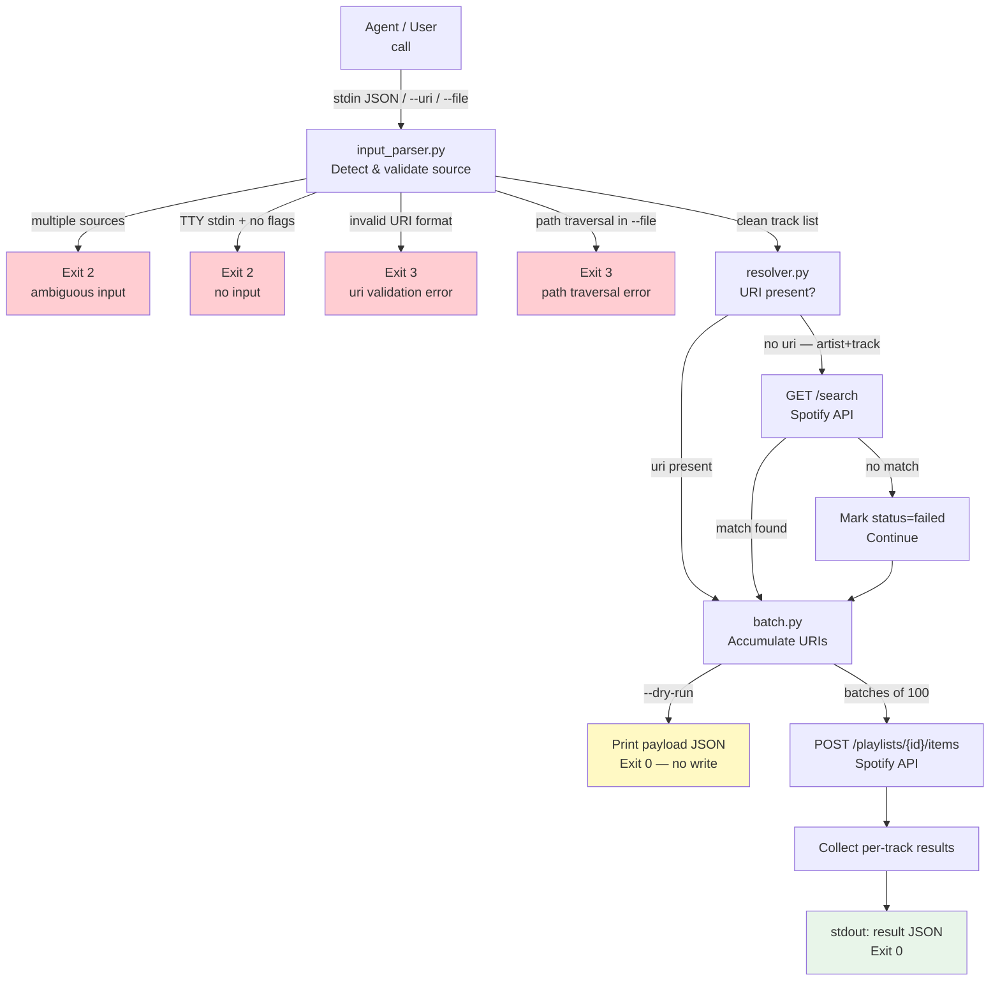

# SPEC-003: Playlist Create

**Version**: 1.0
**SPEC**: SPEC-003
**Created**: 2026-06-03
**Author**: Orlando Bruno
**Status**: Draft
**ADR**: [ADR-003 — Track List Input Contract — JSON stdin for Agent Invocation](../03_ADR/ADR-003__sys__track-list-input-contract.md)

---

## Table of Contents

1. [Requirements](#1-requirements)
2. [Design](#2-design)
3. [Tasks](#3-tasks)

---

## 1. Requirements

### 1.1 Overview

The `playlist` command group provides the core playlist lifecycle for Spotify CLI. It handles creating a named playlist on the user's Spotify account, accepting a list of track URIs via three mutually exclusive input modes (JSON stdin, `--uri` flags, or `--file`), resolving any tracks without a URI through a search-first fallback, batch-adding tracks in groups of 100, and returning a structured JSON result on stdout.

The `playlist` group exposes three sub-commands:

- `spotify-cli playlist create --name "..." [--description "..."] [--public|--private]` — creates an empty playlist and returns its ID and URL
- `spotify-cli playlist add-tracks {playlist_id}` — reads a track list from stdin/flags/file and adds them to an existing playlist
- `spotify-cli playlist create-and-add --name "..." [--description "..."] [--public|--private]` — combined flow: creates a playlist and adds tracks in a single invocation

All three sub-commands support `--dry-run`, which prints the resolved payload as JSON and exits 0 without writing to the Spotify API.

### 1.2 Problem Statement

Creating and populating a Spotify playlist through the official web interface requires manual track-by-track interaction. Agent-driven workflows need a programmatic interface that can accept a structured batch of tracks (some with URIs, some requiring search resolution), apply them to a new or existing playlist in a single invocation, and return machine-readable results without any interactive prompts.

### 1.3 Current State

No playlist creation or track management commands exist. Authentication is handled by SPEC-001 (`spotify_cli/core/spotify_client.py`). The `playlist` command group and all associated modules (`input_parser.py`, `resolver.py`, `batch.py`, `commands.py`) do not yet exist.

### 1.4 User Stories

**Agent batch creation (primary)**

- As an AI agent, I want to pipe a JSON array of tracks to `spotify-cli playlist create-and-add --name "Weekend Mix"` so that I can create and populate a playlist in a single shell command without interactive prompts.
- As an AI agent, I want tracks that lack a `uri` field to be resolved via Spotify search automatically so that I can pass partial metadata and still get a fully populated playlist.
- As an AI agent, I want a structured JSON result on stdout containing per-track status so that I can report which tracks were added and which failed without parsing human-readable text.

**Human one-shot**

- As a user, I want to run `spotify-cli playlist create --name "Road Trip"` and immediately get back the playlist URL so that I can start adding tracks in the Spotify app.
- As a user, I want to pass individual track URIs with `--uri` flags so that I can add specific tracks without constructing a JSON file.
- As a user, I want to load tracks from a `--file path.json` so that I can prepare a playlist from a saved track list.

**Dry-run preview**

- As a user or agent, I want to run any `add-tracks` or `create-and-add` command with `--dry-run` so that I can inspect the resolved track payload before committing writes to the Spotify API.

### 1.5 Functional Requirements

| ID | Requirement | PRD Ref | Priority |
|----|-------------|---------|----------|
| SFR-01 | `playlist create` creates a playlist with the given `--name`; `--description` is optional; visibility defaults to `--private` | FR-05 | Must |
| SFR-02 | `playlist create` returns a JSON object with `playlist_id`, `name`, `url`, and `public` fields | FR-07 | Must |
| SFR-03 | `playlist add-tracks` reads a track list from exactly one of: JSON stdin, `--uri` flags, or `--file`; providing more than one source exits 2 with a structured error | ADR-003 | Must |
| SFR-04 | `playlist add-tracks` validates that each URI in the resolved track list matches `spotify:track:[a-zA-Z0-9]+`; any invalid URI exits 3 with a structured error | NFR-14 | Must |
| SFR-05 | Tracks in the input without a `uri` field but with `artist` and `track` fields are resolved via `GET /search`; if no match is found the track is marked `failed` and processing continues | ADR-003 | Must |
| SFR-06 | Resolved URIs are added to the playlist in batches of at most 100 per `POST /playlists/{id}/items` call | FR-06 | Must |
| SFR-07 | `playlist add-tracks` returns a full JSON result with `tracks_requested`, `tracks_added`, `tracks_failed`, and a per-track `results` array | FR-07 | Must |
| SFR-08 | `--dry-run` on any write command prints the resolved payload as JSON and exits 0 without making any write calls to the Spotify API | FR-12 | Must |
| SFR-09 | `playlist create-and-add` creates a playlist and adds tracks in a single invocation; output combines the playlist metadata with the add-tracks result | FR-05, FR-06 | Must |
| SFR-10 | `--file path.json` is validated against path traversal before opening; any path containing `..` exits 3 with a structured error | NFR-14 | Must |
| SFR-11 | If stdin is a TTY and neither `--uri` nor `--file` is provided, the command exits 2 with a `no input` structured error | ADR-003 | Must |
| SFR-12 | All sub-commands support `--help` / `-h` with `Usage:` and `Example:` blocks | NFR-10 | Must |

### 1.6 Non-Functional Requirements

| ID | Requirement | PRD Ref | Target |
|----|-------------|---------|--------|
| SNFR-01 | All output data goes to stdout as JSON; all error messages go to stderr as structured JSON | NFR-05, NFR-15 | Enforced across all commands |
| SNFR-02 | ANSI escape codes are stripped from stdout when the output is not a TTY | NFR-08 | No color codes in piped output |
| SNFR-03 | Semantic exit codes: 0 = success, 1 = not authenticated / general failure, 2 = bad input / missing required arg, 3 = validation error (URI format, path traversal), 4 = resource not found | NFR-09 | All commands |
| SNFR-04 | Stderr errors use the standard JSON anatomy: `{"error": "...", "reason": "...", "suggestion": "...", "help": "..."}` | NFR-15 | All error paths |
| SNFR-05 | `--help` startup time ≤500ms | NFR-18 | Typer lazy imports |
| SNFR-06 | Distributed via `uv` / `uvx`; no global install required | NFR-07 | `pyproject.toml` entry point |
| SNFR-07 | Minimum Python 3.11; uses stdlib `json` and `sys.stdin` for input parsing | Stack constraint | No third-party input libs |
| SNFR-08 | Playlist editing (track removal, reordering) is not part of this spec; no `--yes` flag is introduced here | FR-13 note | Out of scope |

### 1.7 Success Criteria

- [ ] `spotify-cli playlist create --name "Test"` creates a real playlist and returns JSON with `playlist_id` and `url`, exits 0
- [ ] `spotify-cli playlist add-tracks {id}` with a valid JSON stdin input adds all tracks and returns the results JSON, exits 0
- [ ] `spotify-cli playlist add-tracks {id} --dry-run` prints the payload JSON and exits 0 without any POST call to the Spotify API
- [ ] Tracks without `uri` are resolved via search; failed resolutions appear in `results` with `status: "failed"`
- [ ] 150 tracks produce exactly 2 API batch calls (100 + 50)
- [ ] Invalid URI format exits 3 with structured JSON on stderr
- [ ] Multiple input sources provided together exits 2 with structured JSON on stderr
- [ ] Stdin-is-TTY with no `--uri`/`--file` exits 2 with structured JSON on stderr
- [ ] `spotify-cli playlist create-and-add` completes the full create + add flow in one invocation
- [ ] `uv run pytest tests/playlist/` passes with ≥80% coverage

### 1.8 Scope and Boundaries

**In scope:**
- `playlist create`, `playlist add-tracks`, `playlist create-and-add` commands
- Three input modes: JSON stdin, `--uri` flags, `--file`
- Search-first fallback for tracks without a URI
- Batch-100 strategy for the Spotify API
- `--dry-run` for all write commands
- Structured JSON output and error anatomy
- URI format validation and path traversal rejection for `--file`

**Out of scope:**
- Playlist editing: track removal, reordering, renaming (future spec)
- `--yes` confirmation flag (required for track removal — not yet implemented)
- Duplicate track detection within a batch
- Playlist cover image upload
- Collaborative playlist settings
- Fetching or listing existing playlists

### 1.9 Constraints

- Must reuse `core/spotify_client.py` from SPEC-001 for authentication; no new auth logic
- Must use `spotipy ≥2.25.1` for all Spotify API calls
- Must use `typer` as the CLI framework
- Must use `uv` for package management and test execution
- Input source modes are mutually exclusive; detection logic follows ADR-003
- Batch size is fixed at 100 URIs per API call (Spotify API hard limit)

### 1.10 Dependencies

| Dependency | Type | Notes |
|------------|------|-------|
| `spotipy ≥2.25.1` | Package | `user_playlist_create`, `playlist_add_items`, `search` |
| `typer` | Package | CLI framework, sub-command grouping |
| `core/spotify_client.py` | Internal module | Auth manager factory (prerequisite: SPEC-001) |
| `SPOTIFY_CLIENT_ID` | Env var | Required; validated by `require_client_id()` in SPEC-001 |
| ADR-003 | Design decision | Defines mutually exclusive input modes and stdin JSON schema |
| SPEC-001 | Prerequisite spec | Auth login must be complete before playlist commands can authenticate |

---

## 2. Design

### 2.1 File Structure

```
spotify_cli/
├── main.py                           ← register playlist sub-app
├── core/
│   └── spotify_client.py             ← auth factory (SPEC-001, no changes)
├── playlist/
│   ├── __init__.py
│   ├── commands.py                   ← create / add-tracks / create-and-add
│   ├── input_parser.py               ← stdin / --uri / --file detection + validation
│   ├── resolver.py                   ← search-first fallback for tracks without URI
│   └── batch.py                      ← chunk into 100-URI groups + POST to API
└── tests/
    └── playlist/
        ├── __init__.py
        ├── test_commands.py
        ├── test_input_parser.py
        ├── test_resolver.py
        └── test_batch.py
```

### 2.2 Data Flow



### 2.3 Component Responsibilities

| Component | Public Interface | Responsibility |
|-----------|-----------------|----------------|
| `input_parser.py` | `parse_track_input(uris, file, stdin) -> list[dict]` | Detect which input mode is active, enforce mutual exclusivity, validate URI format, reject path traversal, return normalized track list |
| `resolver.py` | `resolve_tracks(sp, tracks) -> list[ResolvedTrack]` | For each track: pass through if `uri` is present; call `sp.search()` if not; mark `failed` if no match found |
| `batch.py` | `batch_add(sp, playlist_id, resolved_tracks) -> BatchResult` | Chunk resolved URIs into groups of 100; POST each group to `/playlists/{id}/items`; collect per-track status |
| `commands.py` | `create(...)`, `add_tracks(...)`, `create_and_add(...)` | Typer command definitions; wire flags to parser/resolver/batch; format and emit JSON output; handle `--dry-run` |

### 2.4 Output Schemas

**`playlist create` output:**

```json
{
  "playlist_id": "37i9dQZF1DX...",
  "name": "My Playlist",
  "url": "https://open.spotify.com/playlist/37i9dQZF1DX...",
  "public": false
}
```

**`playlist add-tracks` / `create-and-add` output:**

```json
{
  "playlist_id": "37i9dQZF1DX...",
  "tracks_requested": 12,
  "tracks_added": 11,
  "tracks_failed": 1,
  "results": [
    {
      "input": {"uri": "spotify:track:3tnXNkDnn8cpGE1x7QNBQV", "name": "Hurt", "artist": "Johnny Cash"},
      "status": "added"
    },
    {
      "input": {"artist": "Townes Van Zandt", "track": "Pancho and Lefty"},
      "status": "failed",
      "reason": "no search match found"
    }
  ]
}
```

**`--dry-run` output:**

```json
{
  "dry_run": true,
  "playlist_name": "My Playlist",
  "tracks_to_add": 12,
  "batches": 1,
  "payload": ["spotify:track:3tnXNkDnn8cpGE1x7QNBQV", "spotify:track:yyy"]
}
```

**Stderr error anatomy:**

```json
{
  "error": "invalid URI",
  "reason": "spotify:track:BAD_URI does not match expected pattern",
  "suggestion": "URIs must match spotify:track:[a-zA-Z0-9]+",
  "help": "spotify-cli playlist add-tracks --help"
}
```

### 2.5 Key Design Decisions

**Input source detection order**

Per ADR-003, input source detection follows a strict priority: explicit flags first, then stdin. The parser checks for `--uri` flags and `--file` before reading `sys.stdin`. If more than one source is non-empty after evaluation, the command exits 2 immediately — no partial processing. This prevents silent data merging from ambiguous invocations, which is especially critical in agent pipelines.

**Batch strategy: fixed 100-URI chunks, partial failure is not fatal**

Spotify's API rejects requests with more than 100 URIs per call. The batch module slices the resolved URI list into fixed chunks and posts each independently. A failure on one batch does not abort subsequent batches; it is recorded in the results array and reflected in `tracks_failed`. This ensures that a single search miss or transient API error does not discard the rest of the playlist.

**Search fallback: first result accepted, no ranking**

When a track has no `uri`, the resolver calls `sp.search(q="artist:X track:Y", type="track", limit=1)`. The first returned result is accepted without scoring. If the result set is empty, the track is marked `failed`. This is intentional: ranking logic would increase complexity and latency without a clear quality threshold. Callers can pre-resolve ambiguous tracks and supply URIs directly to avoid this path.

**`--dry-run` exits before any write, including playlist creation**

For `create-and-add --dry-run`, neither the playlist create call nor any track add calls are made. The output reflects what would have happened — including the hypothetical `playlist_name` — but no Spotify resource is created. This allows agents to validate their track payloads without side effects.

**Mutual exclusivity enforced in `input_parser.py`, not in Typer**

Typer does not natively enforce mutually exclusive option groups. The `parse_track_input()` function counts how many of `{uris, file, stdin}` are non-empty and raises a structured `InputError` if more than one is set. This keeps validation logic testable in isolation from the CLI layer.

### 2.6 Test Cases

| TC | Sub-command | Scenario | Expected Outcome | Exit Code |
|----|-------------|----------|-----------------|-----------|
| TC-01 | `playlist create` | `--name "Test"` with valid auth | Creates playlist; returns JSON with `playlist_id`, `url`; no track data | 0 |
| TC-02 | `add-tracks` | Valid URI list via JSON stdin | All tracks added; full result JSON on stdout | 0 |
| TC-03 | `add-tracks` | `--dry-run` with valid stdin | Prints payload JSON; no POST call made | 0 |
| TC-04 | `add-tracks` | Track without URI; search match found | Track resolved; `status: "added"` in results | 0 |
| TC-05 | `add-tracks` | Track without URI; search returns empty | `status: "failed"` in results; rest of tracks added | 0 |
| TC-06 | `add-tracks` | Invalid URI format in input | Structured JSON on stderr | 3 |
| TC-07 | `add-tracks` | `--uri` and stdin both provided | Ambiguous input error on stderr | 2 |
| TC-08 | `add-tracks` | Stdin is TTY; no `--uri` / `--file` | No input error on stderr | 2 |
| TC-09 | `add-tracks` | 150 tracks via stdin | Two batch POST calls (100 + 50); full result JSON | 0 |
| TC-10 | `create-and-add` | End-to-end with valid stdin | Creates playlist + adds all tracks in single invocation | 0 |
| TC-11 | `add-tracks` | `--file path.json` | Reads file; same result as stdin equivalent | 0 |
| TC-12 | `add-tracks` | `--file ../etc/passwd` (path traversal) | Structured JSON error on stderr | 3 |
| TC-13 | Any | Not authenticated | Structured JSON error on stderr | 1 |
| TC-14 | `add-tracks` | Playlist ID not found | Structured JSON error on stderr | 4 |

---

## 3. Tasks

### 3.1 Phase 1 — Input Parser (`input_parser.py`)

**Goal:** `parse_track_input()` correctly detects the active input source, enforces mutual exclusivity, validates URI format, rejects path traversal in `--file`, and returns a normalized list of track dicts. No Spotify API calls.

| Task | Description | File(s) |
|------|-------------|---------|
| T-01 | Create `playlist/` package with `__init__.py` and `tests/playlist/__init__.py` | `playlist/__init__.py`, `tests/playlist/__init__.py` |
| T-02 | Implement `InputError` dataclass with `message`, `code`, and `suggestion` fields | `playlist/input_parser.py` |
| T-03 | Implement source detection: count non-empty inputs; raise `InputError(code=2)` if more than one | `playlist/input_parser.py` |
| T-04 | Implement TTY guard: if `sys.stdin.isatty()` and no `--uri`/`--file`, raise `InputError(code=2, message="no input")` | `playlist/input_parser.py` |
| T-05 | Implement `--file` handler: reject path with `..`; read and JSON-parse; raise `InputError(code=3)` on traversal | `playlist/input_parser.py` |
| T-06 | Implement `--uri` handler: wrap each raw URI string into `{"uri": uri}` dict | `playlist/input_parser.py` |
| T-07 | Implement stdin handler: `json.load(sys.stdin)`; raise `InputError` on malformed JSON | `playlist/input_parser.py` |
| T-08 | Implement URI format validator: regex `^spotify:track:[a-zA-Z0-9]+$`; raise `InputError(code=3)` on first invalid URI | `playlist/input_parser.py` |
| T-09 | Write unit tests: TC-06, TC-07, TC-08, TC-12 | `tests/playlist/test_input_parser.py` |

**`playlist/input_parser.py` (key implementation):**

```python
import json
import re
import sys
from dataclasses import dataclass
from pathlib import Path
from typing import Optional

URI_PATTERN = re.compile(r"^spotify:track:[a-zA-Z0-9]+$")


@dataclass
class InputError(Exception):
    message: str
    code: int
    reason: str = ""
    suggestion: str = ""

    def to_dict(self) -> dict:
        return {
            "error": self.message,
            "reason": self.reason,
            "suggestion": self.suggestion,
            "help": "spotify-cli playlist --help",
        }


def parse_track_input(
    uris: Optional[list[str]],
    file: Optional[Path],
    stdin_stream=None,
) -> list[dict]:
    """Detect input source, enforce mutual exclusivity, validate, return normalized track list."""
    if stdin_stream is None:
        stdin_stream = sys.stdin

    sources_active = sum([
        bool(uris),
        file is not None,
        not stdin_stream.isatty(),
    ])

    if sources_active > 1:
        raise InputError(
            message="ambiguous input",
            code=2,
            reason="multiple input sources detected",
            suggestion="provide only one of: stdin, --uri, --file",
        )

    if sources_active == 0:
        raise InputError(
            message="no input",
            code=2,
            reason="no track list provided",
            suggestion="pipe track list via stdin or use --uri / --file",
        )

    if file is not None:
        if ".." in file.parts:
            raise InputError(
                message="invalid file path",
                code=3,
                reason="path traversal detected",
                suggestion="provide an absolute path or a path relative to the current directory without '..'",
            )
        tracks = json.loads(file.read_text())
    elif uris:
        tracks = [{"uri": u} for u in uris]
    else:
        tracks = json.load(stdin_stream)

    _validate_uris(tracks)
    return tracks


def _validate_uris(tracks: list[dict]) -> None:
    for item in tracks:
        uri = item.get("uri")
        if uri is not None and not URI_PATTERN.match(uri):
            raise InputError(
                message="invalid URI",
                code=3,
                reason=f"{uri!r} does not match expected pattern",
                suggestion="URIs must match spotify:track:[a-zA-Z0-9]+",
            )
```

### 3.2 Phase 2 — Batch Module (`batch.py`)

**Goal:** `batch_add()` chunks a resolved URI list into groups of 100, POSTs each group to the Spotify API, and returns a `BatchResult` with per-track status. Partial failures do not abort the remaining batches.

| Task | Description | File(s) |
|------|-------------|---------|
| T-10 | Define `ResolvedTrack` and `BatchResult` dataclasses | `playlist/batch.py` |
| T-11 | Implement `chunk_uris(uris, size=100) -> list[list[str]]` — splits list into fixed-size groups | `playlist/batch.py` |
| T-12 | Implement `batch_add(sp, playlist_id, resolved_tracks) -> BatchResult` — posts each chunk; catches `SpotifyException` per batch | `playlist/batch.py` |
| T-13 | Map per-batch success/failure back to per-track result entries | `playlist/batch.py` |
| T-14 | Write unit tests: TC-09 (150 tracks → 2 batches), partial batch failure | `tests/playlist/test_batch.py` |

**`playlist/batch.py`:**

```python
from dataclasses import dataclass, field
from typing import Any
import spotipy


@dataclass
class ResolvedTrack:
    input: dict
    uri: str | None
    status: str = "pending"
    reason: str = ""


@dataclass
class BatchResult:
    playlist_id: str
    tracks_requested: int
    tracks_added: int = 0
    tracks_failed: int = 0
    results: list[dict] = field(default_factory=list)


def chunk_uris(uris: list[str], size: int = 100) -> list[list[str]]:
    return [uris[i : i + size] for i in range(0, len(uris), size)]


def batch_add(
    sp: spotipy.Spotify,
    playlist_id: str,
    resolved_tracks: list[ResolvedTrack],
) -> BatchResult:
    result = BatchResult(
        playlist_id=playlist_id,
        tracks_requested=len(resolved_tracks),
    )

    # Separate already-failed (search miss) from addable tracks
    for track in resolved_tracks:
        if track.status == "failed":
            result.tracks_failed += 1
            result.results.append({
                "input": track.input,
                "status": "failed",
                "reason": track.reason,
            })

    addable = [t for t in resolved_tracks if t.uri is not None]
    uri_list = [t.uri for t in addable]

    for chunk in chunk_uris(uri_list):
        try:
            sp.playlist_add_items(playlist_id, chunk)
            for uri in chunk:
                track = next(t for t in addable if t.uri == uri)
                result.tracks_added += 1
                result.results.append({"input": track.input, "status": "added"})
        except spotipy.SpotifyException as exc:
            for uri in chunk:
                track = next(t for t in addable if t.uri == uri)
                result.tracks_failed += 1
                result.results.append({
                    "input": track.input,
                    "status": "failed",
                    "reason": str(exc),
                })

    return result
```

### 3.3 Phase 3 — Resolver (`resolver.py`)

**Goal:** `resolve_tracks()` passes through tracks that have a `uri`, calls `sp.search()` for tracks without one, and returns a list of `ResolvedTrack` objects. Tracks that cannot be resolved are marked `failed` without raising an exception.

| Task | Description | File(s) |
|------|-------------|---------|
| T-15 | Implement `resolve_tracks(sp, tracks) -> list[ResolvedTrack]` — routes each track to pass-through or search path | `playlist/resolver.py` |
| T-16 | Implement `_search_track(sp, artist, track) -> str | None` — calls `sp.search()` with `limit=1`; returns URI or None | `playlist/resolver.py` |
| T-17 | Write unit tests: TC-04 (search match found), TC-05 (search returns empty) | `tests/playlist/test_resolver.py` |

**`playlist/resolver.py`:**

```python
from typing import Optional
import spotipy

from playlist.batch import ResolvedTrack


def resolve_tracks(
    sp: spotipy.Spotify,
    tracks: list[dict],
) -> list[ResolvedTrack]:
    resolved = []
    for item in tracks:
        uri = item.get("uri")
        if uri:
            resolved.append(ResolvedTrack(input=item, uri=uri, status="pending"))
        else:
            artist = item.get("artist", "")
            track_name = item.get("track", "")
            found_uri = _search_track(sp, artist, track_name)
            if found_uri:
                resolved.append(ResolvedTrack(input=item, uri=found_uri, status="pending"))
            else:
                resolved.append(ResolvedTrack(
                    input=item,
                    uri=None,
                    status="failed",
                    reason="no search match found",
                ))
    return resolved


def _search_track(
    sp: spotipy.Spotify,
    artist: str,
    track: str,
) -> Optional[str]:
    query = f"artist:{artist} track:{track}"
    results = sp.search(q=query, type="track", limit=1)
    items = results.get("tracks", {}).get("items", [])
    if not items:
        return None
    return items[0]["uri"]
```

### 3.4 Phase 4 — Commands (`commands.py`)

**Goal:** All three sub-commands wire together input_parser, resolver, batch, and `core/spotify_client.py`. `--dry-run` short-circuits before any write. JSON output is emitted to stdout; errors are emitted to stderr with the appropriate exit code.

| Task | Description | File(s) |
|------|-------------|---------|
| T-18 | Register `playlist_app` sub-app in `main.py` | `spotify_cli/main.py` |
| T-19 | Implement `create(name, description, public, dry_run)` command | `playlist/commands.py` |
| T-20 | Implement `add_tracks(playlist_id, uris, file, dry_run)` command with `InputError` handler | `playlist/commands.py` |
| T-21 | Implement `create_and_add(name, description, public, uris, file, dry_run)` command | `playlist/commands.py` |
| T-22 | Add `--dry-run` logic to `add_tracks` and `create_and_add`: compute payload, print JSON, exit 0 | `playlist/commands.py` |
| T-23 | Add `SpotifyException` handler for playlist-not-found (HTTP 404 → exit 4) | `playlist/commands.py` |
| T-24 | Write unit tests: TC-01, TC-02, TC-03, TC-10, TC-11, TC-13, TC-14 | `tests/playlist/test_commands.py` |

**`playlist/commands.py` (skeleton):**

```python
import json
import sys
from pathlib import Path
from typing import Annotated, Optional

import typer
import spotipy

from spotify_cli.core.spotify_client import get_auth_manager, require_client_id
from playlist.input_parser import parse_track_input, InputError
from playlist.resolver import resolve_tracks
from playlist.batch import batch_add, chunk_uris


def _emit_error(error: dict, code: int) -> None:
    typer.echo(json.dumps(error), err=True)
    raise typer.Exit(code=code)


def create(
    name: Annotated[str, typer.Option("--name", help="Playlist name.")],
    description: Annotated[str, typer.Option("--description")] = "",
    public: Annotated[bool, typer.Option("--public/--private")] = False,
) -> None:
    """
    Create an empty Spotify playlist.

    Usage: spotify-cli playlist create --name "My Playlist" [--description "..."] [--public]
    Example: spotify-cli playlist create --name "Road Trip" --private
    """
    require_client_id()
    auth_manager = get_auth_manager()
    sp = spotipy.Spotify(auth_manager=auth_manager)
    user_id = sp.current_user()["id"]

    playlist = sp.user_playlist_create(
        user=user_id,
        name=name,
        public=public,
        description=description,
    )
    typer.echo(json.dumps({
        "playlist_id": playlist["id"],
        "name": playlist["name"],
        "url": playlist["external_urls"]["spotify"],
        "public": playlist["public"],
    }))
    raise typer.Exit(code=0)


def add_tracks(
    playlist_id: Annotated[str, typer.Argument(help="Target playlist ID.")],
    uris: Annotated[Optional[list[str]], typer.Option("--uri")] = None,
    file: Annotated[Optional[Path], typer.Option("--file")] = None,
    dry_run: Annotated[bool, typer.Option("--dry-run")] = False,
) -> None:
    """
    Add tracks to an existing playlist from stdin, --uri flags, or --file.

    Usage: spotify-cli playlist add-tracks {playlist_id} [--uri URI ...] [--file path.json] [--dry-run]
    Example: echo '[{"uri":"spotify:track:xxx"}]' | spotify-cli playlist add-tracks abc123
    """
    require_client_id()

    try:
        tracks = parse_track_input(uris=uris, file=file)
    except InputError as exc:
        _emit_error(exc.to_dict(), exc.code)

    if dry_run:
        uris_resolved = [t["uri"] for t in tracks if t.get("uri")]
        typer.echo(json.dumps({
            "dry_run": True,
            "playlist_id": playlist_id,
            "tracks_to_add": len(tracks),
            "batches": max(1, (len(uris_resolved) + 99) // 100),
            "payload": uris_resolved,
        }))
        raise typer.Exit(code=0)

    auth_manager = get_auth_manager()
    sp = spotipy.Spotify(auth_manager=auth_manager)

    try:
        resolved = resolve_tracks(sp, tracks)
        result = batch_add(sp, playlist_id, resolved)
    except spotipy.SpotifyException as exc:
        if exc.http_status == 404:
            _emit_error({"error": "playlist not found", "reason": str(exc), "suggestion": "check the playlist ID", "help": "spotify-cli playlist --help"}, 4)
        _emit_error({"error": "spotify API error", "reason": str(exc), "suggestion": "", "help": "spotify-cli playlist --help"}, 1)

    typer.echo(json.dumps({
        "playlist_id": result.playlist_id,
        "tracks_requested": result.tracks_requested,
        "tracks_added": result.tracks_added,
        "tracks_failed": result.tracks_failed,
        "results": result.results,
    }))
    raise typer.Exit(code=0)
```

### 3.5 Phase 5 — Tests

**Goal:** All 14 test cases pass; coverage ≥80% for all four modules in `playlist/`.

| Task | Description | File(s) |
|------|-------------|---------|
| T-25 | Scaffold test files with shared spotipy mock fixture | All `tests/playlist/test_*.py` |
| T-26 | `test_input_parser.py`: TC-06 (invalid URI), TC-07 (ambiguous source), TC-08 (TTY no flags), TC-12 (path traversal) | `tests/playlist/test_input_parser.py` |
| T-27 | `test_resolver.py`: TC-04 (search found), TC-05 (search empty) | `tests/playlist/test_resolver.py` |
| T-28 | `test_batch.py`: TC-09 (150 tracks → 2 batches), partial batch failure | `tests/playlist/test_batch.py` |
| T-29 | `test_commands.py`: TC-01 (create), TC-02 (add stdin), TC-03 (dry-run), TC-10 (create-and-add), TC-11 (--file), TC-13 (not authenticated), TC-14 (404) | `tests/playlist/test_commands.py` |
| T-30 | Run coverage; confirm ≥80% across all four modules | Manual / CI |

**Test scaffold (`tests/playlist/test_commands.py`):**

```python
import json
from io import StringIO
from pathlib import Path
from unittest.mock import MagicMock, patch

import pytest
from typer.testing import CliRunner

from spotify_cli.main import app

runner = CliRunner(mix_stderr=False)


@pytest.fixture(autouse=True)
def set_env(monkeypatch):
    monkeypatch.setenv("SPOTIFY_CLIENT_ID", "test-id")
    monkeypatch.setenv("SPOTIFY_CLIENT_SECRET", "test-secret")


@pytest.fixture
def mock_sp():
    sp = MagicMock()
    sp.current_user.return_value = {"id": "test_user"}
    sp.user_playlist_create.return_value = {
        "id": "playlist123",
        "name": "Test",
        "external_urls": {"spotify": "https://open.spotify.com/playlist/playlist123"},
        "public": False,
    }
    sp.playlist_add_items.return_value = {}
    sp.search.return_value = {"tracks": {"items": [{"uri": "spotify:track:resolved"}]}}
    return sp


def test_create(mock_sp):
    """TC-01: playlist create returns JSON with playlist_id and url."""
    with patch("spotify_cli.playlist.commands.spotipy.Spotify", return_value=mock_sp):
        result = runner.invoke(app, ["playlist", "create", "--name", "Test"])
    assert result.exit_code == 0
    data = json.loads(result.stdout)
    assert data["playlist_id"] == "playlist123"
    assert "url" in data


def test_add_tracks_stdin(mock_sp, tmp_path):
    """TC-02: add-tracks with valid JSON stdin adds all tracks."""
    payload = json.dumps([{"uri": "spotify:track:abc123"}])
    with patch("spotify_cli.playlist.commands.spotipy.Spotify", return_value=mock_sp), \
         patch("sys.stdin", StringIO(payload)), \
         patch("sys.stdin.isatty", return_value=False):
        result = runner.invoke(app, ["playlist", "add-tracks", "playlist123"])
    assert result.exit_code == 0
    data = json.loads(result.stdout)
    assert data["tracks_added"] == 1


def test_add_tracks_dry_run(mock_sp):
    """TC-03: --dry-run prints payload JSON, no POST call made."""
    payload = json.dumps([{"uri": "spotify:track:abc123"}])
    with patch("spotify_cli.playlist.commands.spotipy.Spotify", return_value=mock_sp), \
         patch("sys.stdin", StringIO(payload)), \
         patch("sys.stdin.isatty", return_value=False):
        result = runner.invoke(app, ["playlist", "add-tracks", "playlist123", "--dry-run"])
    assert result.exit_code == 0
    data = json.loads(result.stdout)
    assert data["dry_run"] is True
    mock_sp.playlist_add_items.assert_not_called()


def test_batch_150_tracks():
    """TC-09: 150 tracks produce exactly 2 batch POST calls."""
    from playlist.batch import batch_add, ResolvedTrack
    sp = MagicMock()
    sp.playlist_add_items.return_value = {}
    tracks = [
        ResolvedTrack(input={"uri": f"spotify:track:{i:04d}"}, uri=f"spotify:track:{i:04d}")
        for i in range(150)
    ]
    result = batch_add(sp, "playlist123", tracks)
    assert sp.playlist_add_items.call_count == 2
    assert result.tracks_added == 150
```

### 3.6 Estimates Summary

| Phase | Tasks | Estimated Effort |
|-------|-------|-----------------|
| Phase 1 — Input parser | T-01 to T-09 | 2h |
| Phase 2 — Batch module | T-10 to T-14 | 1.5h |
| Phase 3 — Resolver | T-15 to T-17 | 1h |
| Phase 4 — Commands | T-18 to T-24 | 2.5h |
| Phase 5 — Tests | T-25 to T-30 | 2h |
| **Total** | **30 tasks** | **~9h** |

### 3.7 Verification Plan

**Automated (run after each phase):**

```bash
# Run all playlist tests
uv run pytest tests/playlist/ -v

# Run with coverage report
uv run pytest tests/playlist/ \
  --cov=spotify_cli/playlist \
  --cov-report=term-missing

# Enforce ≥80% threshold
uv run pytest tests/playlist/ \
  --cov=spotify_cli/playlist \
  --cov-fail-under=80
```

**Manual end-to-end (after Phase 4):**

```bash
# Verify playlist create
uv run spotify-cli playlist create --name "Spec Test" --private

# Verify dry-run (no API write, inspect payload)
echo '[{"uri":"spotify:track:3tnXNkDnn8cpGE1x7QNBQV","name":"Hurt","artist":"Johnny Cash"}]' \
  | uv run spotify-cli playlist create-and-add --name "Dry Run Test" --dry-run

# Verify search fallback
echo '[{"artist":"Johnny Cash","track":"Hurt"}]' \
  | uv run spotify-cli playlist add-tracks {playlist_id}

# Verify invalid URI exits 3
echo '[{"uri":"not:a:valid:uri"}]' \
  | uv run spotify-cli playlist add-tracks {playlist_id}
echo $?   # expect 3

# Verify ambiguous input exits 2
echo '[{"uri":"spotify:track:abc"}]' \
  | uv run spotify-cli playlist add-tracks {playlist_id} --uri spotify:track:abc
echo $?   # expect 2
```

### 3.8 Change Log

| Version | Date | Author | Change |
|---------|------|--------|--------|
| 1.0 | 2026-06-03 | Orlando Bruno | Initial draft — all three sections |
